# Swati Publications Frontend (`swati-clientside`)
## Current Application Stage & Complete 178-Route Reference Matrix

> **Repository**: `Cryoflake/Swathi-Publications-Frontend` (`swati-clientside`)  
> **Document Status**: Active Snapshot  
> **Current Stage**: **Feature-Complete UI Shells / Pre-Staging Integration**  
> **Architecture Pattern**: SSR and Hydrated Single Page App (TanStack Start, TanStack Router, TanStack Query)  
> **Runtime and Stack**: React 19, Vite 8, Nitro SSR, TypeScript 5, TailwindCSS v4, Radix UI  

---

## Part 1: Current Stage and Point of Work

### 1.1 Current Application Stage
The `swati-clientside` frontend is in the **Feature-Complete UI Shells / Pre-Staging Integration** stage. 

The application features a fully articulated route hierarchy consisting of **178 TypeScript route files** compiled through TanStack Router into a 139 KB deterministic route tree (`src/routeTree.gen.ts`). The visual presentation layer includes 46 Radix UI accessible primitives, comprehensive TailwindCSS v4 theme tokens, specialized magazine flipbook viewers (`PdfBookViewer.tsx`), and extensive Recharts data visualization dashboards for administrative analytics.

```mermaid
flowchart LR
    subgraph BrowserLayer ["Client Runtime"]
        UserDevice["Desktop Browser and Mobile PWA"]
        NginxGateway["Nginx Reverse Proxy (Ports 80 and 443)"]
        UserDevice --> NginxGateway
    end

    subgraph TanStackStart ["TanStack Start Application (Port 3000)"]
        RouterTree["TanStack Router (178 Route Modules)"]
        RootShell["Root Layout (root.tsx)"]
        Components["Component Layer (46 UI Primitives and Shells)"]
        QueryHooks["TanStack Query Hooks (React Query v5)"]

        RootShell --> RouterTree
        RouterTree --> Components
        Components --> QueryHooks
    end

    subgraph DataServices ["Data Transport and Backend Gateway"]
        ApiClient["ApiClient (src/lib/api/client.ts)"]
        EndpointModules["17 Typed Endpoint Clients"]
        BackendREST["Backend REST API (swathi-serverside:3000)"]

        QueryHooks --> EndpointModules
        EndpointModules --> ApiClient
        ApiClient --> BackendREST
    end

    NginxGateway --> RootShell
```

---

### 1.2 Quantitative Implementation Inventory

| Component Layer | Implemented Count | Source Location | Status |
| :--- | :---: | :--- | :---: |
| **Total Route Modules** | **178** | `src/routes/` | **Complete** |
| **Admin and BI Routes** | **72** | `src/routes/admin.*.tsx` | **Complete** |
| **Catalog and Taxonomy Routes** | **29** | `src/routes/` | **Complete** |
| **Subscriber and Account Routes** | **25** | `src/routes/` | **Complete** |
| **Commerce and Checkout Routes** | **13** | `src/routes/` | **Complete** |
| **Auth and Onboarding Routes** | **9** | `src/routes/auth.*.tsx` | **Complete** |
| **System and Fallback Routes** | **5** | `src/routes/system.*.tsx` | **Complete** |
| **UI Primitives (Radix UI)** | **46** | `src/components/ui/` | **Complete** |
| **Specialized Domain Components** | **16** | `src/components/` | **Complete** |
| **API Domain Clients** | **17** | `src/lib/api/endpoints/` | **Complete** |
| **Automated Test Suites** | **0** | `src/tests/` (pending) | **Pending** |

---

### 1.3 What Is Working Right Now

1. **Full Route Hierarchy Compiled**: All 178 file-based routes compile cleanly into `src/routeTree.gen.ts`, providing type-safe routing, parameter extraction (`$slug`, `$bookId`), and search query parsing.
2. **Accessible Component Design System**: 46 UI primitives built on Radix UI and TailwindCSS v4 supporting responsive navigation, dialogs, drawers, accordions, tabs, forms, and color themes.
3. **Realistic 3D Magazine Flipbook & PDF Reader**: `PdfBookViewer.tsx` provides dual reading experiences: interactive page-flip physics via `page-flip` and continuous progressive canvas scrolling via `pdfjs-dist`.
4. **DRM Security Protocols**: Client-side DRM token negotiation via `POST /api/v1/pdf/drm/token`, anti-tamper watermark rendering, and right-click copy protection.
5. **Multi-Domain Admin & BI Workspaces**: 72 admin routes covering publication publishing states, drag-and-drop media uploads, user roles, 19 system setting panels, and Recharts executive dashboards.
6. **Robust Transport Architecture**: `src/lib/api/client.ts` implements automatic JWT rotation, concurrency request locks on 401 statuses, exponential backoff retries, and comprehensive error mapping.

---

### 1.4 Exact Current Point of Work (Boundary Items)

Development is paused at the **local dependency hydration and live gateway integration boundary**:

1. **Live Backend API Binding**:
   - The client has full API client bindings in `src/lib/api/client.ts`, but many views currently leverage React Query mock fallbacks when the backend daemon is offline.
2. **Production PDF.js Worker Hosting**:
   - Static asset copying for the PDF.js web worker (`pdf.worker.mjs`) needs explicit production CDN/public directory aliasing in Vite configuration.
3. **Automated Testing Suite**:
   - 0 automated unit, component, or end-to-end test suites are currently present in the client repository.

---

## Part 2: Complete 178-Route Reference Matrix

Below is the complete, verified inventory of all **178 route files** implemented in `src/routes/`.

---

### 1. Public Core & Periodical Discovery (22 Routes)

| Route File | Target URL | Primary Functional Purpose | Key Components / API |
| :--- | :--- | :--- | :--- |
| `__root.tsx` | `*` | Root application shell, navigation header, footer, toast notifications | `<Outlet />`, `site-header.tsx`, `site-footer.tsx` |
| `index.tsx` | `/` | Homepage showcase hero, featured editions, trending periodicals | `useFeaturedPublications()`, `useTrendingPublications()` |
| `latest.tsx` | `/latest` | Newly released magazine issues and books | `useLatestPublications()` |
| `trending.tsx` | `/trending` | Most-read articles, trending weekly stories | `useTrendingPublications()` |
| `pricing.tsx` | `/pricing` | Public subscription pricing table and feature matrices | `useSubscriptionPlans()` |
| `about.tsx` | `/about` | Swati Publications heritage, history, and editorial board | Static CMS presentation |
| `contact.tsx` | `/contact` | Editorial feedback and inquiries submission form | `POST /api/v1/system/contact` |
| `faq.tsx` | `/faq` | Frequently asked questions regarding digital and print reading | Accordion UI primitive |
| `privacy.tsx` | `/privacy` | Privacy policy and data handling terms | Static legal text |
| `terms.tsx` | `/terms` | Digital terms of service and subscriber agreements | Static legal text |
| `search.tsx` | `/search` | Global catalog search results with multilingual Telugu filters | `useSearch()` |
| `publications.tsx` | `/publications` | Publications catalog layout container | `<Outlet />`, catalog layout |
| `publications.index.tsx` | `/publications/` | Complete periodical directory with facet filters | `usePublications()` |
| `publications.weekly.tsx` | `/publications/weekly` | Dedicated Swathi Weekly magazine archive | `usePublications({ type: "weekly" })` |
| `publications.monthly.tsx`| `/publications/monthly`| Dedicated Swathi Monthly magazine archive | `usePublications({ type: "monthly" })` |
| `publications.special.tsx`| `/publications/special`| Festival special editions and collector issues | `usePublications({ type: "special" })` |
| `publications.archive.tsx`| `/publications/archive`| Historical archival browser by decade and year | `usePublicationsArchive()` |
| `publications.digital.tsx`| `/publications/digital`| Digital-exclusive releases and web-first periodicals | `usePublications({ format: "digital" })` |
| `publications.$slug.tsx` | `/publications/:slug` | Issue detail, page count, pricing, Table of Contents, preview | `usePublicationBySlug()` |
| `news.tsx` | `/news` | Press releases and editorial announcements index | `useNews()` |
| `articles.tsx` | `/articles` | Literary columns, serial extracts, articles index | `useArticles()` |
| `articles.$slug.tsx` | `/articles/:slug` | Full article reader with threaded comment section | `useArticleBySlug()`, `useComments()` |

---

### 2. Content Taxonomy & Literary Catalog (19 Routes)

| Route File | Target URL | Primary Functional Purpose | Key Components / API |
| :--- | :--- | :--- | :--- |
| `authors.tsx` | `/authors` | Authors section layout wrapper | `<Outlet />` |
| `authors.index.tsx` | `/authors/` | Directory of verified authors, columnists, and contributors | `useAuthors()` |
| `authors.$slug.tsx` | `/authors/:slug` | Author profile, biography, published bibliographies | `useAuthorBySlug()` |
| `publishers.tsx` | `/publishers` | Publishers section layout wrapper | `<Outlet />` |
| `publishers.index.tsx` | `/publishers/` | Directory of publishing houses and imprints | `usePublishers()` |
| `publishers.$slug.tsx` | `/publishers/:slug` | Publisher profile and catalog showcase | `usePublisherBySlug()` |
| `categories.tsx` | `/categories` | Categories section layout wrapper | `<Outlet />` |
| `categories.$slug.tsx` | `/categories/:slug` | Filtered content list by primary literary category | `useCategoryBySlug()` |
| `genres.tsx` | `/genres` | Genres section layout wrapper | `<Outlet />` |
| `genres.index.tsx` | `/genres/` | Grid of literary genres (Thriller, Romance, Spiritual, Social) | `useGenres()` |
| `genres.$slug.tsx` | `/genres/:slug` | Filtered catalog by genre | `useGenreBySlug()` |
| `series.tsx` | `/series` | Serial novels and periodic series wrapper | `<Outlet />` |
| `series.index.tsx` | `/series/` | Listing of ongoing serialized stories and episodic fiction | `useSeries()` |
| `series.$slug.tsx` | `/series/:slug` | Serial novel detail with chapter index | `useSeriesBySlug()` |
| `collections.tsx` | `/collections` | Curated collections section wrapper | `<Outlet />` |
| `collections.$slug.tsx` | `/collections/:slug` | Curated anthology listing | `useCollectionBySlug()` |
| `library.book.$slug.tsx` | `/library/book/:slug` | Direct subscriber access portal for specific library item | `useBookDetail()` |
| `library.new.tsx` | `/library/new` | Newly acquired library items for subscriber | `useUserLibrary({ filter: "new" })` |
| `library.recent.tsx` | `/library/recent` | Recently opened publications | `useRecentReads()` |

---

### 3. DRM PDF Streaming & Flipbook Reader (2 Routes)

| Route File | Target URL | Primary Functional Purpose | Key Components / API |
| :--- | :--- | :--- | :--- |
| `read.$bookId.tsx` | `/read/:bookId` | Full-screen interactive 3D magazine flipbook reader | `PdfBookViewer.tsx`, `page-flip` |
| `reader.$bookId.tsx` | `/reader/:bookId` | Continuous vertical scroll document reading mode | `PdfBookViewer.tsx`, `pdfjs-dist` |

---

### 4. Authentication & Identity Onboarding (9 Routes)

| Route File | Target URL | Primary Functional Purpose | Key Components / API |
| :--- | :--- | :--- | :--- |
| `auth.tsx` | `/auth` | Authentication layout container | `<Outlet />` |
| `auth.login.tsx` | `/auth/login` | Email/password subscriber login form | `useLogin()` |
| `login.tsx` | `/login` | Root alias for subscriber login | `useLogin()` |
| `auth.register.tsx` | `/auth/register` | New subscriber account creation form | `useRegister()` |
| `register.tsx` | `/register` | Root alias for subscriber registration | `useRegister()` |
| `auth.forgot.tsx` | `/auth/forgot` | Password recovery request form | `useForgotPassword()` |
| `auth.reset.tsx` | `/auth/reset` | Secure password reset token redemption | `useResetPassword()` |
| `auth.verify-email.tsx` | `/auth/verify-email` | Email verification token confirmation | `useVerifyEmail()` |
| `auth.verify-otp.tsx` | `/auth/verify-otp` | 6-digit phone OTP verification input screen | `input-otp`, `useVerifyOtp()` |

---

### 5. Member Dashboard & Engagement (8 Routes)

| Route File | Target URL | Primary Functional Purpose | Key Components / API |
| :--- | :--- | :--- | :--- |
| `dashboard.tsx` | `/dashboard` | Member dashboard layout wrapper | `<Outlet />` |
| `dashboard.index.tsx` | `/dashboard/` | Subscriber overview: continue reading, reading streak, stats | `useDashboardOverview()` |
| `dashboard.activity.tsx`| `/dashboard/activity`| Timeline of reader interactions, notes, highlights | `useUserActivity()` |
| `dashboard.continue.tsx`| `/dashboard/continue`| In-progress periodicals with progress percentages | `useContinueReading()` |
| `dashboard.notifications.tsx`| `/dashboard/notifications`| Member alerts, issue releases, editorial updates | `useNotifications()` |
| `dashboard.recommended.tsx`| `/dashboard/recommended`| Personalized content recommendations | `useRecommendations()` |
| `dashboard.stats.tsx` | `/dashboard/stats` | Personal reading analytics, books completed, time read | `useReadingStats()` |
| `dashboard.trending.tsx`| `/dashboard/trending`| Trending content among subscriber community | `useTrendingPublications()` |

---

### 6. Subscriber Library & Personal Collections (11 Routes)

| Route File | Target URL | Primary Functional Purpose | Key Components / API |
| :--- | :--- | :--- | :--- |
| `library.tsx` | `/library` | Personal library layout container | `<Outlet />` |
| `library.index.tsx` | `/library/` | All owned, borrowed, and subscribed titles | `useUserLibrary()` |
| `library.continue.tsx` | `/library/continue` | Unfinished magazine issues with resumption bookmarks | `useContinueReading()` |
| `library.bookmarks.tsx`| `/library/bookmarks`| Page-level bookmarks with personal notes | `useBookmarks()` |
| `library.favorites.tsx`| `/library/favorites`| Saved favorite editions and articles | `useFavorites()` |
| `library.history.tsx` | `/library/history` | Chronological reading audit trail | `useReadingHistory()` |
| `library.recommended.tsx`| `/library/recommended`| Tailored suggestions based on library contents | `useRecommendations()` |
| `library.trending.tsx` | `/library/trending` | Popular items in subscriber library | `useTrendingPublications()` |
| `discover.tsx` | `/discover` | Discovery portal layout container | `<Outlet />` |
| `discover.index.tsx` | `/discover/` | Algorithmic discovery feed | `useDiscoveryFeed()` |
| `discover.new.tsx` | `/discover/new` | New catalog additions | `useNewReleases()` |

---

### 7. Account Profile, Security & Preferences (14 Routes)

| Route File | Target URL | Primary Functional Purpose | Key Components / API |
| :--- | :--- | :--- | :--- |
| `account.tsx` | `/account` | Subscriber account layout container | `<Outlet />` |
| `account.index.tsx` | `/account/` | Account overview and profile snapshot | `useProfile()` |
| `account.profile.tsx` | `/account/profile` | Edit full name, bio, phone number, and avatar | `useUpdateProfile()` |
| `account.security.tsx`| `/account/security`| Change password, enable TOTP 2FA, active device sessions | `useSessions()`, `use2FA()` |
| `account.preferences.tsx`| `/account/preferences`| Reading theme, font size, language preferences | `usePreferences()` |
| `account.subscription.tsx`| `/account/subscription`| Active plan status, renewal date, cancellation options | `useSubscription()` |
| `account.orders.tsx` | `/account/orders` | Purchase history for physical books and merchandise | `useOrders()` |
| `account.payment-methods.tsx`| `/account/payment-methods`| Saved payment methods and billing addresses | `usePaymentMethods()` |
| `account.addresses.tsx`| `/account/addresses`| Saved physical delivery addresses | `useAddresses()` |
| `account.bookmarks.tsx`| `/account/bookmarks`| Account bookmark management | `useBookmarks()` |
| `account.favorites.tsx`| `/account/favorites`| Account favorites management | `useFavorites()` |
| `account.notes.tsx` | `/account/notes` | Personal annotations and study notes | `useNotes()` |
| `account.history.tsx` | `/account/history` | Reading history management and privacy clearance | `useReadingHistory()` |
| `account.downloads.tsx`| `/account/downloads`| Offline PWA downloaded issues manifest | `useOfflineDownloads()` |

---

### 8. E-Commerce Storefront, Cart & Checkout (7 Routes)

| Route File | Target URL | Primary Functional Purpose | Key Components / API |
| :--- | :--- | :--- | :--- |
| `cart.tsx` | `/cart` | Shopping cart view with item quantities and coupons | `useCart()` |
| `wishlist.tsx` | `/wishlist` | Saved items for future purchase | `useWishlist()` |
| `checkout.tsx` | `/checkout` | Multi-step checkout layout wrapper | `<Outlet />` |
| `checkout.address.tsx` | `/checkout/address` | Step 1: Delivery address selection or entry | `useAddresses()` |
| `checkout.payment.tsx` | `/checkout/payment` | Step 2: Payment method selection (UPI/Card) | `usePaymentGateways()` |
| `checkout.review.tsx` | `/checkout/review` | Step 3: Order line items, tax, and total review | `useCart()` |
| `checkout.success.tsx` | `/checkout/success` | Step 4: Order confirmation, receipt, and invoice link | `useOrderConfirmation()` |

---

### 9. Subscriptions & Pricing Management (6 Routes)

| Route File | Target URL | Primary Functional Purpose | Key Components / API |
| :--- | :--- | :--- | :--- |
| `subscription.tsx` | `/subscription` | Subscription management layout container | `<Outlet />` |
| `subscription.plans.tsx`| `/subscription/plans`| Plan comparison matrix (Weekly, Monthly, Annual) | `useSubscriptionPlans()` |
| `subscription.checkout.tsx`| `/subscription/checkout`| Subscription billing entry and payment gateway intent | `useCreateSubscription()` |
| `subscription.manage.tsx`| `/subscription/manage`| Pause, resume, upgrade, or cancel subscription | `useManageSubscription()` |
| `subscription.success.tsx`| `/subscription/success`| Subscription activation confirmation | Confetti, receipt |
| `discover.saved-searches.tsx`| `/discover/saved-searches`| Manage saved catalog search queries | `useSavedSearches()` |

---

### 10. Global Search & Smart Discovery (7 Routes)

| Route File | Target URL | Primary Functional Purpose | Key Components / API |
| :--- | :--- | :--- | :--- |
| `discover.trending.tsx` | `/discover/trending` | Trending literary works across readers | `useTrending()` |
| `discover.recommendations.tsx`| `/discover/recommendations`| Algorithmic recommendations based on reading affinity | `useRecommendations()` |
| `discover.history.tsx` | `/discover/history` | Historical discovery timeline | `useSearchHistory()` |
| `admin.search.tsx` | `/admin/search` | Search indexing status and query tuning workbench | `useSearchAdmin()` |
| `admin.rec-analytics.tsx`| `/admin/rec-analytics`| Recommendation click-through rate analytics | `useRecommendationMetrics()` |
| `admin.recommendations.index.tsx`| `/admin/recommendations/`| Recommendation rule list | `useRecommendationRules()` |
| `admin.recommendations.rules.tsx`| `/admin/recommendations/rules`| Define content pairing and author weighting rules | `useRecommendationRules()` |

---

### 11. Administrative Operations & CMS Workspaces (18 Routes)

| Route File | Target URL | Primary Functional Purpose | Key Components / API |
| :--- | :--- | :--- | :--- |
| `admin.tsx` | `/admin` | Admin dashboard shell with navigation sidebar | `<Outlet />`, `AdminSidebar.tsx` |
| `admin.index.tsx` | `/admin/` | Admin operational overview and quick stats | `useAdminOverview()` |
| `admin.workspace.tsx` | `/admin/workspace` | Editor in-box for review assignments | `useEditorialInbox()` |
| `admin.publications.tsx`| `/admin/publications`| Publication CRUD management and issue linking | `useAdminPublications()` |
| `admin.issues.tsx` | `/admin/issues` | Periodical issue management (Swathi Weekly/Monthly) | `useAdminIssues()` |
| `admin.books.tsx` | `/admin/books` | Physical and digital book inventory management | `useAdminBooks()` |
| `admin.articles.tsx` | `/admin/articles` | Article CMS and 8-stage editorial state machine | `useAdminArticles()` |
| `admin.news.tsx` | `/admin/news` | News bulletin and press release publisher | `useAdminNews()` |
| `admin.drafts.tsx` | `/admin/drafts` | Unpublished editorial drafts | `useAdminDrafts()` |
| `admin.scheduled.tsx` | `/admin/scheduled` | Scheduled future publishing queue | `useAdminScheduled()` |
| `admin.categories.tsx`| `/admin/categories`| Category taxonomy editor | `useAdminCategories()` |
| `admin.series.tsx` | `/admin/series` | Serial novel volume editor | `useAdminSeries()` |
| `admin.collections.tsx`| `/admin/collections`| Curated collection and anthology builder | `useAdminCollections()` |
| `admin.media.tsx` | `/admin/media` | Media asset library and S3 upload manager | `useAdminMedia()` |
| `admin.pdfs.tsx` | `/admin/pdfs` | PDF linearization, optimization, and DRM inspect | `useAdminPdfs()` |
| `admin.archive.tsx` | `/admin/archive` | Historical archive scanning and ingestion | `useAdminArchive()` |
| `admin.editors-picks.tsx`| `/admin/editors-picks`| Curate featured carousel on homepage | `useEditorsPicks()` |
| `admin.featured.tsx` | `/admin/featured` | Manage featured magazine spotlight | `useFeaturedManager()` |

---

### 12. Executive Business Intelligence (BI) & Recharts Dashboards (11 Routes)

| Route File | Target URL | Primary Functional Purpose | Key Components / API |
| :--- | :--- | :--- | :--- |
| `admin.bi.tsx` | `/admin/bi` | BI dashboard shell and navigation tabs | `<Outlet />` |
| `admin.bi.executive.tsx`| `/admin/bi/executive`| Executive summary: GMV, churn, active subscribers | Recharts Area/Bar |
| `admin.bi.revenue.tsx` | `/admin/bi/revenue` | Revenue analytics by product line and periodical | Recharts LineChart |
| `admin.bi.subscriptions.tsx`| `/admin/bi/subscriptions`| Subscription cohort retention and renewal rates | Recharts BarChart |
| `admin.bi.payments.tsx` | `/admin/bi/payments` | Payment gateway success rates and refund metrics | Recharts PieChart |
| `admin.bi.publishing.tsx`| `/admin/bi/publishing`| Publishing frequency and article output velocity | Recharts LineChart |
| `admin.bi.publications.tsx`| `/admin/bi/publications`| Individual magazine issue performance comparison | Recharts BarChart |
| `admin.bi.content.tsx` | `/admin/bi/content` | Most-read articles, completion rates, drop-offs | Recharts Table |
| `admin.bi.reading.tsx` | `/admin/bi/reading` | Total reading hours and daily active reader trends | Recharts AreaChart |
| `admin.bi.search.tsx` | `/admin/bi/search` | Search volume, top search terms, zero-result terms | Recharts BarChart |
| `admin.bi.users.tsx` | `/admin/bi/users` | User acquisition, geographic distribution | Recharts Map/Chart |

---

### 13. Content Recommendations & Reporting Engine (10 Routes)

| Route File | Target URL | Primary Functional Purpose | Key Components / API |
| :--- | :--- | :--- | :--- |
| `admin.recommendations.tsx`| `/admin/recommendations`| Recommendation manager layout | `<Outlet />` |
| `admin.reports.tsx` | `/admin/reports` | Reporting center layout | `<Outlet />` |
| `admin.reports.builder.tsx`| `/admin/reports/builder`| Custom report builder with field and filter selector | Custom Query Builder |
| `admin.reports.scheduled.tsx`| `/admin/reports/scheduled`| Automated scheduled email reports | `useScheduledReports()` |
| `admin.reports.exports.tsx`| `/admin/reports/exports`| CSV/Excel download queue | `useReportExports()` |
| `admin.reports.library.tsx`| `/admin/reports/library`| Pre-built report template library | `useReportLibrary()` |
| `admin.trending-mgmt.tsx`| `/admin/trending-mgmt`| Override trending algorithms with editorial pins | `useTrendingManagement()` |
| `admin.comments.tsx` | `/admin/comments` | Comment moderation, approval, and spam flagging | `useCommentModeration()` |
| `admin.tasks.tsx` | `/admin/tasks` | Editorial task assignment and review deadlines | `useEditorialTasks()` |
| `admin.analytics.tsx` | `/admin/analytics` | Content engagement deep-dive | Recharts metrics |

---

### 14. System Settings & Integration Administration (19 Routes)

| Route File | Target URL | Primary Functional Purpose | Key Components / API |
| :--- | :--- | :--- | :--- |
| `admin.settings.tsx` | `/admin/settings` | Settings layout container and sidebar | `<Outlet />` |
| `admin.settings.general.tsx`| `/admin/settings/general`| Site name, contact email, default currency | `useSettings("general")` |
| `admin.settings.branding.tsx`| `/admin/settings/branding`| Logo upload, primary brand colors, typography | `useSettings("branding")` |
| `admin.settings.localization.tsx`| `/admin/settings/localization`| Telugu / English default language settings | `useSettings("localization")` |
| `admin.settings.auth.tsx` | `/admin/settings/auth` | Session timeouts, password strength policies | `useSettings("auth")` |
| `admin.settings.security.tsx`| `/admin/settings/security`| Rate limit thresholds, CSP headers, CORS domains | `useSettings("security")` |
| `admin.settings.storage.tsx`| `/admin/settings/storage`| Storage backend selector (S3/R2/Local/Failover) | `useSettings("storage")` |
| `admin.settings.database.tsx`| `/admin/settings/database`| MongoDB connection metrics, connection pool stats | `useSettings("database")` |
| `admin.settings.email.tsx` | `/admin/settings/email` | SMTP configuration, email templates | `useSettings("email")` |
| `admin.settings.notifications.tsx`| `/admin/settings/notifications`| Notification channels (Web Push, Email, In-App) | `useSettings("notifications")` |
| `admin.settings.payments.tsx`| `/admin/settings/payments`| Payment gateway credentials (Razorpay/Stripe) | `useSettings("payments")` |
| `admin.settings.integrations.tsx`| `/admin/settings/integrations`| Webhook endpoints, analytics trackers | `useSettings("integrations")` |
| `admin.settings.api.tsx` | `/admin/settings/api` | API key generation and scopes | `useSettings("api")` |
| `admin.settings.developer.tsx`| `/admin/settings/developer`| Developer sandbox mode, debug logs | `useSettings("developer")` |
| `admin.settings.backup.tsx`| `/admin/settings/backup`| Database snapshot triggers and Glacier vault sync | `useSettings("backup")` |
| `admin.settings.maintenance.tsx`| `/admin/settings/maintenance`| Toggle maintenance mode banner sitewide | `useSettings("maintenance")` |
| `admin.settings.monitoring.tsx`| `/admin/settings/monitoring`| Prometheus metrics status, uptime monitors | `useSettings("monitoring")` |
| `admin.settings.audit.tsx` | `/admin/settings/audit` | Immutable security audit log browser | `useAuditLogs()` |
| `admin.settings.system-info.tsx`| `/admin/settings/system-info`| Node.js version, memory usage, build commit hash | `useSystemInfo()` |

---

### 15. Commerce Admin & User Roles (5 Routes)

| Route File | Target URL | Primary Functional Purpose | Key Components / API |
| :--- | :--- | :--- | :--- |
| `admin.orders.tsx` | `/admin/orders` | Customer physical book orders, fulfillment status | `useAdminOrders()` |
| `admin.payments.tsx` | `/admin/payments` | Payment transaction log and refund processor | `useAdminPayments()` |
| `admin.subscriptions.tsx`| `/admin/subscriptions`| Active member subscriptions, renewal tracking | `useAdminSubscriptions()` |
| `admin.coupons.tsx` | `/admin/coupons` | Promo code generator, discount rules, caps | `useAdminCoupons()` |
| `admin.campaigns.tsx` | `/admin/campaigns` | Seasonal discount marketing campaigns | `useAdminCampaigns()` |

---

### 16. User Administration & System Fallbacks (7 Routes)

| Route File | Target URL | Primary Functional Purpose | Key Components / API |
| :--- | :--- | :--- | :--- |
| `admin.users.tsx` | `/admin/users` | User account management, ban, activate, detail | `useAdminUsers()` |
| `admin.roles.tsx` | `/admin/roles` | RBAC role permission assignments | `useAdminRoles()` |
| `admin.staff.tsx` | `/admin/staff` | Editorial and administrative staff directory | `useAdminStaff()` |
| `admin.support.tsx` | `/admin/support` | Customer support ticket queue | `useSupportTickets()` |
| `admin.notifications.tsx`| `/admin/notifications`| Dispatch platform-wide announcements | `useAdminNotifications()` |
| `system.401.tsx` | `/system/401` | Unauthorized access fallback screen | Clean 401 Shell |
| `system.403.tsx` | `/system/403` | Forbidden / Insufficient permissions screen | Clean 403 Shell |
| `system.500.tsx` | `/system/500` | Internal server error fallback screen | Clean 500 Shell |
| `system.maintenance.tsx`| `/system/maintenance`| Platform maintenance in progress notice | Maintenance Shell |
| `system.offline.tsx` | `/system/offline` | PWA offline detection and cached reads banner | Offline Shell |

---

## 3. Route Summary & Verification
The 178 routes provide an exhaustive user journey covering:
- **Public readers**: Browsing periodicals, viewing issue samples, reading articles.
- **Subscribers**: 3D flipbook reading with byte-range DRM streaming, bookmarking, resume reading across devices.
- **Shoppers**: Ordering physical prints, digital subscriptions, coupon redemption.
- **Editorial Staff**: 8-stage state machine reviews, chapter manifests, media uploads.
- **Executive Leadership**: 11 Recharts BI dashboards for revenue, churn, and readership telemetry.
- **DevOps / Administrators**: 19 platform configuration panels, RBAC roles, audit log viewer.
