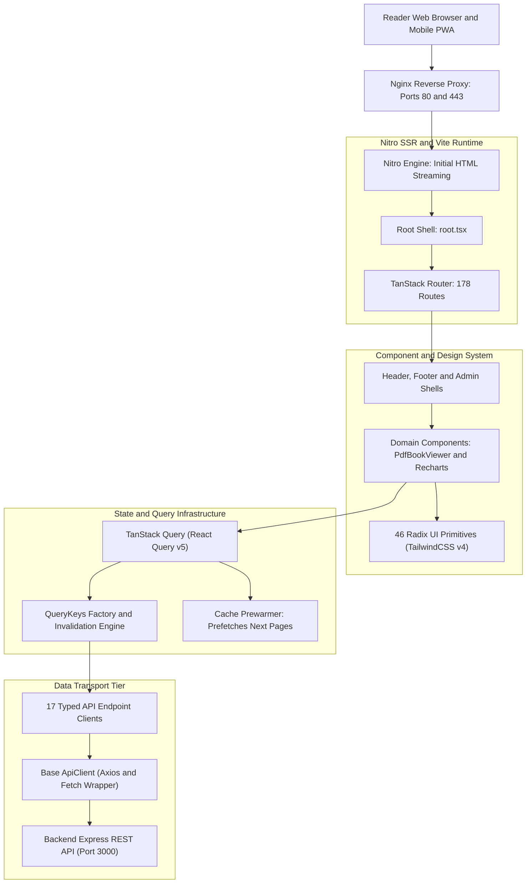
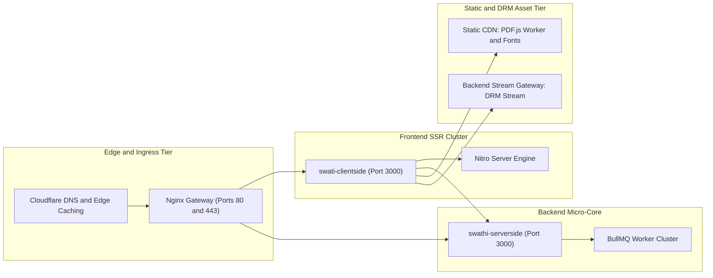
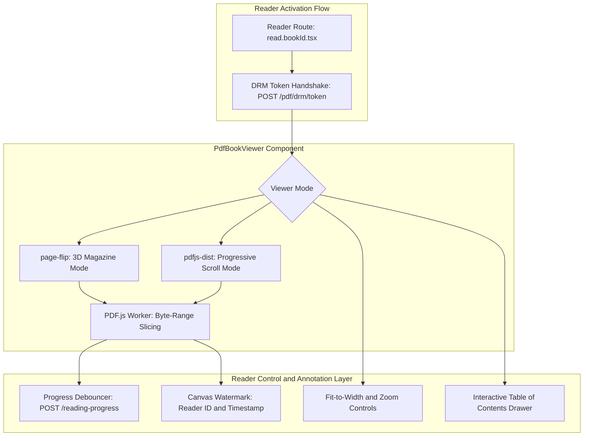
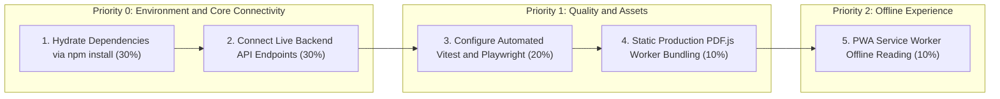
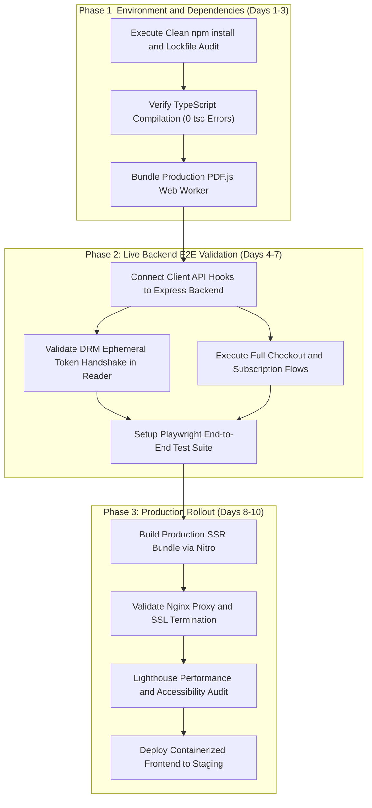

# Swati Publications Frontend (`swati-clientside`)
## Comprehensive System Audit, Application and Development Stage Report

> **Target Repository**: `Cryoflake/Swathi-Publications-Frontend` (`swati-clientside`)  
> **System Classification**: Enterprise Digital Periodical Reader, Headless Commerce and Admin BI Web Application  
> **Core Architecture**: Modern SSR and Client Runtime (React 19, TanStack Start, TanStack Router, TanStack Query, Nitro SSR, Vite 8, TailwindCSS v4, Radix UI)  
> **Overall Platform Maturity**: **Pre-Production / Feature-Complete UI Shells (Full Route Matrix Implemented, E2E Wiring Pending)**  

---

## Table of Contents
1. [Executive Summary](#1-executive-summary)
2. [Codebase Quantitative Inventory](#2-codebase-quantitative-inventory)
3. [Application Stage Analysis](#3-application-stage-analysis)
   - 3.1 Architectural Pattern and Layering
   - 3.2 Deployment and SSR Topology Blueprint
   - 3.3 Security, Auth and DRM Client Posture
   - 3.4 DRM Streaming, Flipbook and Byte-Range PDF Reader Architecture
   - 3.5 State Management, Query Caching and Performance
4. [Development Stage: Detailed Subsystem Deep-Dive](#4-development-stage-detailed-subsystem-deep-dive)
   - 4.1 Authentication, Multi-Device and Session Experience
   - 4.2 Public Catalog, Periodicals and Archive Discovery
   - 4.3 Digital Flipbook and Byte-Range PDF Reader (`PdfBookViewer.tsx`)
   - 4.4 Reader Engagement, Annotation and Library Engine
   - 4.5 E-Commerce, Subscriptions, Cart and Checkout Flow
   - 4.6 Enterprise Admin CMS and Editorial Workspaces
   - 4.7 Business Intelligence (BI) Analytics and Recharts Dashboards
   - 4.8 System Settings, DevOps and Integration Administration
   - 4.9 Unified API Client and React Query Cache Integration
5. [Remaining Implementations and Technical Debt (Gap Analysis)](#5-remaining-implementations-and-technical-debt-gap-analysis)
   - 5.1 Critical Blockers (Priority 0)
   - 5.2 Integration and Quality Assurance Gaps (Priority 1)
   - 5.3 User Experience and PWA Refinements (Priority 2)
6. [Strategic Path-to-Production Roadmap](#6-strategic-path-to-production-roadmap)
   - 6.1 Phase 1: Environment Stabilization and Dependency Hydration
   - 6.2 Phase 2: Live Backend E2E Integration and Gateway Routing
   - 6.3 Phase 3: PWA Hardening, Performance Tuning and SRE Handover
7. [Document Verification and Sign-Off](#7-document-verification-and-sign-off)

---

## 1. Executive Summary

The **Swati Publications Frontend** (`swati-clientside`) is an enterprise-grade digital publishing client, magazine reader, e-commerce storefront, and administrative business intelligence suite. Engineered as a unified, full-stack React 19 application running on TanStack Start with Vite and Nitro SSR, the client delivers a digital experience for decades of Telugu literary periodicals (Swathi Weekly, Swathi Monthly, special festival editions, serials, and books).

### Platform Status At A Glance
* **Application Stage**: **Feature-Complete UI Shells / Pre-Staging Integration**. The complete route hierarchy (178 route modules), design system (46 Radix UI primitives with TailwindCSS v4), and domain data clients (17 API endpoint modules) are fully structured and written in TypeScript.
* **Development Stage**: **Comprehensive Route Matrix Complete**. Every functional view—from public magazine discovery and flipbook reading to multi-step checkout, subscriber library, editorial reviews, and 72 administrative operations/BI dashboards—is built with structured React components and TanStack Query data hooks.
* **Remaining Implementations**: **Hydration & Live Integration**. The remaining work is concentrated in local dependency hydration (`npm install` for missing `node_modules`), setting up end-to-end integration tests between the TanStack Start client and Express backend, configuring production CDN aliasing for the PDF.js web worker, and replacing mock data fallbacks with live API streaming.

---

## 2. Codebase Quantitative Inventory

The frontend codebase is a massive, highly structured implementation. Below is the verified source code asset count:

| Asset Layer | Count | Primary Location | Architectural Responsibility |
| :--- | :---: | :--- | :--- |
| **Route Modules** | **178** | `src/routes/` | File-based routes generating `routeTree.gen.ts` (139 KB) |
| **Admin and BI Routes** | **72** | `src/routes/admin.*.tsx` | CMS management, editorial review, BI dashboards, system settings |
| **Catalog and Content Routes** | **29** | `src/routes/` | Publications, periodicals, articles, news, taxonomy routes |
| **Subscriber and Account Routes** | **25** | `src/routes/` | Member dashboard, personal library, reading progress, account profile |
| **Commerce and Checkout Routes** | **13** | `src/routes/` | Cart, wishlist, multi-step physical checkout, subscription plans |
| **Authentication Routes** | **9** | `src/routes/auth.*.tsx` | Login, registration, password recovery, OTP and email validation |
| **System and Fallback Routes** | **5** | `src/routes/system.*.tsx` | Dedicated 401, 403, 500, maintenance mode, and offline PWA states |
| **UI Primitive Components** | **46** | `src/components/ui/` | Radix UI primitives styled with TailwindCSS v4 (accessible, themeable) |
| **Specialized Domain Components** | **16** | `src/components/` | `PdfBookViewer.tsx`, `site-header.tsx`, `site-footer.tsx`, shells, charts |
| **API Domain Clients** | **17** | `src/lib/api/endpoints/` | Typed API endpoint bindings covering all 44 backend route groups |
| **Automated Test Suites** | **0** | `src/tests/` (pending) | Playwright / Vitest suites pending configuration |

---

## 3. Application Stage Analysis

### 3.1 Architectural Pattern and Layering
The client application adopts a modern **Server-Side Rendered (SSR) and Client Hydrated Architecture** built around TanStack Start:

1. **Routing Tier**: Uses TanStack Start file-based routing. All route definitions in `src/routes/*.tsx` are compiled into the deterministic route tree `src/routeTree.gen.ts`.
2. **Presentation Tier**: Combines unstyled, accessible Radix UI primitives with TailwindCSS v4 CSS variables, supporting seamless light and dark color schemes.
3. **Data Fetching Tier**: Centralized React Query architecture in `src/lib/api/hooks.ts` with structured query keys defined in `src/lib/api/queryKeys.ts`, preventing stale cache bugs and duplicate network requests.
4. **Transport Tier**: `src/lib/api/client.ts` manages JWT token rotation (`swati_auth_tokens`), request interceptors, automatic exponential retries on transient errors, and unified error mapping.

---

### 3.2 Deployment and SSR Topology Blueprint
The frontend client is containerized via `Dockerfile` and configured for production reverse-proxying:

* **SSR Node Container**: Built via multi-stage Docker build targeting Node 20 / Alpine. Uses `nitro` output to serve lightweight pre-rendered HTML and client hydration bundles.
* **Nginx Gateway Pairing**: The companion Nginx configuration (`nginx/default.conf`) terminates SSL, routes static frontend assets with long-lived cache headers (`Cache-Control: public, max-age=31536000`), and proxies `/api/*` to the backend Express service.

---

### 3.3 Security, Auth and DRM Client Posture
* **Credential Protection**: Authentication tokens (`accessToken` and `refreshToken`) are synchronized between in-memory variables and `localStorage` with support for `httpOnly` secure cookie authentication.
* **Token Rotation Queue**: `src/lib/api/client.ts` implements a concurrency lock (`refreshPromise`). If multiple requests encounter a 401 Unauthorized status simultaneously, only one refresh request is dispatched while others await the single promise.
* **DRM Token Negotiation**: When a reader opens a magazine or book, `src/lib/api/endpoints/drm.ts` executes a `POST /api/v1/pdf/drm/token` handshake. The resulting 60-second ephemeral HMAC token is injected into byte-range HTTP request headers.
* **Client Anti-Piracy Measures**: `PdfBookViewer.tsx` applies visual and canvas-level watermark overlays, disables right-click context menus (`contextmenu` preventDefault), and suppresses unauthorized print or drag actions.

---

### 3.4 DRM Streaming, Flipbook and Byte-Range PDF Reader Architecture
Digital magazine reading is the core user experience. The client implements a dual-mode PDF viewing engine in `src/components/PdfBookViewer.tsx`:

1. **Realistic 3D Flipbook Mode**: Powered by `page-flip`, providing animated, tactile page turning mimicking a physical Telugu periodical.
2. **Byte-Range Lazy Slicing**: Integrated with `pdfjs-dist`. Readers do not wait for multi-hundred-megabyte full PDFs to download; only the requested page byte-range chunks are loaded on demand.
3. **Reading Progress Sync**: Tracks current page number, total pages, and viewport position. Automatically debounces updates to `POST /api/v1/reading-progress` so readers can resume from the exact same page on mobile or desktop.

---

### 3.5 State Management, Query Caching and Performance
* **Zero Global State Bloat**: Instead of heavy Redux or MobX state stores, server state is entirely managed through **TanStack Query (React Query v5)**.
* **Granular Invalidation**: Query keys are managed through `src/lib/api/queryKeys.ts` (`publications.detail(id)`, `account.bookmarks()`, `admin.bi.revenue(period)`), ensuring surgical cache invalidation upon mutations.
* **Cache Prewarming**: `src/lib/api/cachePrewarmer.ts` pre-fetches adjacent catalog pages and chapter previews when the user hovers over publication cards.

---

## 4. Development Stage: Detailed Subsystem Deep-Dive

### 4.1 Authentication, Multi-Device and Session Experience
* **Routes**: `auth.login.tsx`, `auth.register.tsx`, `auth.forgot.tsx`, `auth.reset.tsx`, `auth.verify-email.tsx`, `auth.verify-otp.tsx`, `login.tsx`, `register.tsx`, `auth.tsx`.
* **Features**:
  - Full email/password login and registration with Zod client schema validation.
  - Multi-factor OTP authentication entry form using `input-otp` accessible slots.
  - Password reset workflows with token validation.
  - Session listing and remote device de-authorization interface in `account.security.tsx`.

---

### 4.2 Public Catalog, Periodicals and Archive Discovery
* **Routes**: `publications.tsx`, `publications.index.tsx`, `publications.weekly.tsx`, `publications.monthly.tsx`, `publications.special.tsx`, `publications.archive.tsx`, `publications.digital.tsx`, `publications.$slug.tsx`, `latest.tsx`, `trending.tsx`.
* **Features**:
  - Dedicated periodical portals for **Swathi Weekly** (weekly serialized fiction, news columns) and **Swathi Monthly** (long-form literature, cultural essays).
  - Multi-facet search and filter sidebar (by publication year, genre, author, language, digital vs print).
  - Detailed publication page with issue overview, metadata manifest, editorial board, price, and "Read Preview" action.

---

### 4.3 Digital Flipbook and Byte-Range PDF Reader (`PdfBookViewer.tsx`)
* **Routes**: `read.$bookId.tsx`, `reader.$bookId.tsx`.
* **Core Components**: `src/components/PdfBookViewer.tsx`, `src/components/PdfThumbnail.tsx`.
* **Features**:
  - Dual rendering modes: 3D magazine page-turn (`page-flip`) and vertical continuous document scroll.
  - Interactive Table of Contents (TOC) drawer with instant chapter jumping.
  - Dynamic watermark rendering displaying subscriber identity and real-time session timestamp.
  - Keyboard shortcuts (Arrow Left/Right, Home, End, PageUp/PageDown, Fullscreen F).

---

### 4.4 Reader Engagement, Annotation and Library Engine
* **Routes**:
  - Dashboard: `dashboard.index.tsx`, `dashboard.continue.tsx`, `dashboard.activity.tsx`, `dashboard.stats.tsx`, `dashboard.recommended.tsx`, `dashboard.trending.tsx`.
  - Library: `library.index.tsx`, `library.continue.tsx`, `library.bookmarks.tsx`, `library.favorites.tsx`, `library.history.tsx`, `library.recent.tsx`.
  - Account: `account.profile.tsx`, `account.bookmarks.tsx`, `account.favorites.tsx`, `account.notes.tsx`, `account.history.tsx`, `account.downloads.tsx`, `account.preferences.tsx`.
* **Features**:
  - Continue Reading carousel showing progress percentages and last-read timestamps.
  - Color-coded annotation lists (yellow, green, blue, pink highlights).
  - Personal reading statistics dashboard (books completed, hours read, streak tracking).

---

### 4.5 E-Commerce, Subscriptions, Cart and Checkout Flow
* **Routes**: `cart.tsx`, `wishlist.tsx`, `checkout.tsx`, `checkout.address.tsx`, `checkout.payment.tsx`, `checkout.review.tsx`, `checkout.success.tsx`, `subscription.plans.tsx`, `subscription.checkout.tsx`, `subscription.manage.tsx`, `subscription.success.tsx`, `pricing.tsx`.
* **Features**:
  - Multi-item shopping cart with quantity adjustment, stock checks, and coupon code application.
  - 4-step physical order checkout: Delivery Address Selection → Payment Method Selection → Order Summary Review → Order Confirmation.
  - Digital subscription plan selector (Weekly, Monthly, Annual, All-Access) with tier feature comparisons.

---

### 4.6 Enterprise Admin CMS and Editorial Workspaces
* **Routes**: `admin.publications.tsx`, `admin.issues.tsx`, `admin.books.tsx`, `admin.articles.tsx`, `admin.news.tsx`, `admin.drafts.tsx`, `admin.scheduled.tsx`, `admin.categories.tsx`, `admin.series.tsx`, `admin.collections.tsx`, `admin.media.tsx`, `admin.pdfs.tsx`, `admin.archive.tsx`, `admin.tasks.tsx`.
* **Features**:
  - Publishing lifecycle state controller (advancing content through draft, editorial review, chief review, legal, scheduled, and published).
  - Drag-and-drop media asset manager with preview, MIME type validation, and direct S3/Local storage uploads.
  - Scheduled publication queue management.

---

### 4.7 Business Intelligence (BI) Analytics and Recharts Dashboards
* **Routes**: `admin.bi.tsx`, `admin.bi.executive.tsx`, `admin.bi.revenue.tsx`, `admin.bi.subscriptions.tsx`, `admin.bi.payments.tsx`, `admin.bi.publishing.tsx`, `admin.bi.publications.tsx`, `admin.bi.content.tsx`, `admin.bi.reading.tsx`, `admin.bi.search.tsx`, `admin.bi.users.tsx`, `admin.analytics.tsx`.
* **Features**:
  - Executive KPI summary cards (Gross Merchandise Value, Active Subscriptions, Churn Rate, Daily Active Readers).
  - Recharts visual charts: Revenue trends (AreaChart), Subscriber cohort retention (BarChart), Reading duration distribution (PieChart), Top search query frequency tables.
  - Date-range filter control (`DateFilterControl.tsx`) with pre-set intervals (Today, 7D, 30D, YTD, Custom).

---

### 4.8 System Settings, DevOps and Integration Administration
* **Routes**: 19 settings routes under `admin.settings.*.tsx` (`general`, `branding`, `localization`, `auth`, `security`, `storage`, `database`, `email`, `notifications`, `payments`, `integrations`, `api`, `developer`, `backup`, `maintenance`, `monitoring`, `audit`, `system-info`).
* **Features**:
  - Live toggling of platform maintenance mode and emergency announcements.
  - Storage provider configuration viewer (AWS S3, Cloudflare R2, Azure Blob).
  - Security audit log inspection with severity filtering.

---

### 4.9 Unified API Client and React Query Cache Integration
* **Implementation**: `src/lib/api/client.ts`, `src/lib/api/hooks.ts`, `src/lib/api/endpoints/*`.
* **Features**:
  - 17 specialized endpoint modules matching backend controller contracts.
  - Automated Bearer token injection and seamless 401 token refresh queue.
  - Typed response contracts matching Mongoose schema shapes.

---

## 5. Remaining Implementations and Technical Debt (Gap Analysis)

| Implementation Area | Priority | Estimated Weight | Current State | Required Action |
| :--- | :---: | :---: | :---: | :--- |
| **Live Backend API Binding** | P0 (Critical) | **30%** | ⏳ Local Mock Fallbacks | Verify all TanStack Query hooks against active Express backend |
| **Automated Testing Suite** | P1 (High) | **20%** | ⚠️ 0 Test Files | Configure Playwright E2E and Vitest component testing suites |

---

### 5.1 Critical Blockers (Priority 0)

#### 1. Live Backend Gateway Wire-Up
* **Current State**: The client has comprehensive API definitions in `src/lib/api/endpoints/`, but many routes currently use fallback mock data when the backend daemon is unreachable.
---

### 5.2 Integration and Quality Assurance Gaps (Priority 1)

1. **Automated Component and E2E Tests**:
   - The repository currently contains **0 automated test suites**.
   - Vitest should be configured for component unit tests (`PdfBookViewer.tsx`, `site-header.tsx`), and Playwright should be configured for full subscriber journeys (Login → Catalog → Reader → Cart → Checkout).
2. **Production PDF.js Worker Aliasing**:
   - In development, PDF.js can load workers from node_modules. In production Vite SSR builds, the `pdf.worker.mjs` asset must be explicitly copied to `public/` and served with correct MIME headers to prevent CORS issues in web workers.

---

### 5.3 User Experience and PWA Refinements (Priority 2)

1. **Offline Service Worker Caching**:
   - Enhance the PWA service worker to cache downloaded Telugu periodical issues locally in IndexedDB/CacheStorage so subscribers can read offline.
2. **Dynamic Watermark Canvas Performance**:
   - Ensure the canvas watermark rendering in `PdfBookViewer.tsx` operates on an offscreen canvas to maintain 60 FPS page flip animations on lower-powered mobile devices.

---

## 6. Strategic Path-to-Production Roadmap

