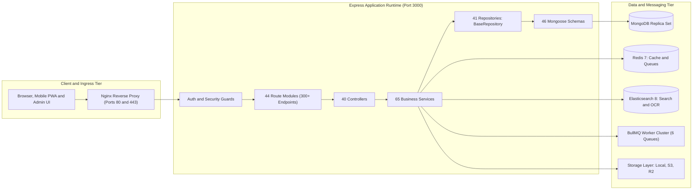

# Swathi Publications Backend (`swathi-serverside`)
## Current Application Stage & Complete API Route Reference

> **Repository**: `Cryoflake/Swathi-Publications-Backend` (`swathi-serverside`)  
> **Document Status**: Active Snapshot  
> **Current Stage**: **Hardened Staging / Pre-Production Integration Stage**  
> **Architecture Pattern**: Layered Modular Core (Routes → Controllers → Services → Repositories → Models)  
> **Runtime & Stack**: Node.js 20, Express 4, TypeScript 5, MongoDB 6/7, Redis 7, BullMQ, Elasticsearch 8  

---

## Part 1: Current Stage & Point of Work

### 1.1 Current Application Stage
The `swathi-serverside` backend is in the **Hardened Staging / Pre-Production** state. 

All internal software layers—data schemas, database indexes, business logic services, data-access repositories, HTTP controllers, and route validation pipelines—are **100% written and integrated**. The core platform operates as a high-throughput, modular monolithic service ready for containerized deployment behind an Nginx reverse proxy.

---

### 1.2 Quantitative Implementation Inventory

| Component Layer | Implemented Count | Source Location | Status |
| :--- | :---: | :--- | :---: |
| **Mongoose Data Models** | **46** | `backend/src/models/` | **Complete** |
| **Business Logic Services** | **65** | `backend/src/services/` | **Complete** |
| **Data Access Repositories** | **41** | `backend/src/repositories/` | **Complete** |
| **HTTP Request Controllers** | **40** | `backend/src/controllers/` | **Complete** |
| **Route Modules** | **44** | `backend/src/routes/` | **Complete** |
| **Exposed API Endpoints** | **300+** | Dual-mounted at `/api` and `/api/v1` | **Complete** |
| **Zod Request Validators** | **16** | `backend/src/validators/` | **Complete** |
| **Storage Providers** | **6** | `backend/src/providers/storage/` | **Complete** |
| **BullMQ Background Workers** | **6** | `backend/src/jobs/workers/` | **Complete** |
| **Jest Automated Test Suites** | **43** | `backend/src/tests/` | **Complete** |

---

### 1.3 What Is Working Right Now
1. **Zero-Trust Identity & Session Management**:
   - Access & refresh JWT token rotation with `httpOnly` secure cookies.
   - Strict device attestation enforcing a **maximum of 3 concurrent active devices** per reader.
   - Remote session listing and remote revocation by session ID.
   - TOTP-based two-factor authentication (RFC 6238) and 10 single-use emergency backup codes.
2. **Publishing Catalog & Taxonomy**:
   - Multi-tier content catalog for books, magazine editions (Swathi Weekly, Swathi Monthly, Specials), serials, collections, authors, publishers, and genres.
   - Automatic URL slug generation, duplicate resolution, and soft-delete/restore lifecycles.
3. **8-Stage Editorial State Machine**:
   - Enforced publishing gates: `draft` → `assigned` → `editor_review` → `senior_editor_review` → `chief_editor_review` → `legal_review` → `scheduled` → `published`.
   - Immutable audit logging of transitions with actor IDs, roles, and review remarks in `WorkflowTransition`.
4. **Multi-Entity Version Control**:
   - Snapshotting for articles, books, and magazine issues with normalized SHA-256 integrity hashing.
   - Granular field-level delta diffing (`added`, `modified`, `deleted`) and atomic rollback with safety snapshots.
5. **DRM Protected PDF Streaming**:
   - Fast Web View byte-range slicing (RFC 7233) allowing instant rendering of Page 1 without full document downloads.
   - 60-second ephemeral HMAC-SHA256 streaming tokens bound directly to client IP addresses.
   - Dynamic forensic watermarking passed via headers (`X-DRM-Watermark-Id`, `X-DRM-Watermark-Text`).
   - Local NVMe hot-SSD cache engine (`HotCacheService`).
6. **Commerce & Monetization Engine**:
   - Dual-mounted routes (`/api/*` and `/api/v1/*`) for subscriptions, orders, invoices, and cart operations.
   - Subscription lifecycle management: active subscription retrieval, pause, resume, renewal, and cancel-at-period-end.
   - Coupon discount engine (percentage and fixed amounts with minimum spend and usage caps).
   - Automated PDF invoice creation with sequence numbering (`INV-YYYY-XXXX`).
7. **Reader Engagement & Annotation**:
   - Cross-device reading progress synchronization with debounced position updates.
   - Chronological reading history, bookmarks, notes, and color-coded text highlights.
   - In-app notification engine with 90-day automatic MongoDB TTL expiration.
8. **Pluggable Storage & Directory Scanner/Watcher**:
   - Unified storage interface supporting AWS S3, Cloudflare R2, Google Cloud Storage, Azure Blob, and Local Disk.
   - Failover circuit breaker (`FailoverStorageProvider`) routing to secondary object storage on 3 consecutive failures.
   - Real-time Server-Sent Events (SSE) watcher pushing events when new PDFs are detected on disk.
9. **Search, NLP & OCR Workbench**:
   - Elasticsearch integration with Telugu edge-ngram analyzers.
   - TextRank extractive summarization and TF-IDF keyword extraction.
   - Human-in-the-loop review workbench for scanned heritage Telugu pages.
10. **Background Jobs & Domain Events**:
    - Decoupled `EventBus` with exponential backoff and Dead Letter Queue (DLQ).
    - BullMQ workers for PDF optimization, linearization, hot-cache warming, metadata refresh, and checksum audits.

---

### 1.4 Exact Current Point of Work (Boundary Items)
Development is paused at the **live external adapter integration boundary**:

1. **Payment Provider Simulation**:
   - `paymentProviderFactory.ts` currently routes Razorpay, Stripe, and PhonePe to `NamedDummyPaymentProvider`.
   - Real SDK bindings for Razorpay (UPI/cards) and Stripe (cards/recurring), along with live webhook HMAC signature verifications, are pending implementation.
2. **SMS Gateway for Mobile OTP**:
   - `OTPService.ts` (lines 127–130) generates cryptographically secure 6-digit codes and returns them in-memory for testing.
   - Integration with a live SMS provider (MSG91, Twilio, or Fast2SMS) for phone delivery is pending.
3. **Login 2FA Enforcement Check**:
   - In `authController.ts` (lines 103–109), the MFA challenge block inside the `login()` function is currently commented out. Users with 2FA enabled currently authenticate with password alone until this challenge gate is wired.
4. **Environment Secret Injection**:
   - Production cloud credentials (AWS S3 / Cloudflare R2 access keys, live Elasticsearch host URL, SMTP server credentials) await population in `.env.production`.

---

## Part 2: Complete Inventory of Implemented API Routes

The API exposes **44 route modules** across primary prefixes `/api` and `/api/v1`.

### 1. Authentication & Session Management (`/api/auth`)
*Controller: `authController.ts` | Base Path: `/api/auth`*

| Method | Route Path | Access / Role | Description & Parameters |
| :--- | :--- | :---: | :--- |
| `POST` | `/api/auth/register` | Public | Register new subscriber account (`email`, `username`, `password`, `fullName`) |
| `POST` | `/api/auth/login` | Public | Authenticate via email/password, issue JWT access + refresh cookies (`deviceId`) |
| `POST` | `/api/auth/refresh` | Public | Rotate refresh token and issue new access token |
| `POST` | `/api/auth/logout` | Authenticated | Revoke current user session and clear cookies (`revokeAllSessions` optional) |
| `GET` | `/api/auth/verify-email` | Public | Verify email address via URL query token (`?token=xxx`) |
| `POST` | `/api/auth/resend-verification` | Public | Re-send email verification link (`email`) |
| `POST` | `/api/auth/forgot-password` | Public | Send password reset link to user email (`email`) |
| `POST` | `/api/auth/reset-password` | Public | Reset account password using token (`token`, `password`) |
| `POST` | `/api/auth/send-password-reset-otp` | Public | Send 6-digit password reset OTP code (`email`) |
| `POST` | `/api/auth/verify-password-reset-otp` | Public | Verify reset OTP and return temporary reset token (`email`, `code`) |
| `POST` | `/api/auth/reset-password-with-otp` | Public | Reset password using verified OTP token (`token`, `password`) |
| `POST` | `/api/auth/change-password` | Authenticated | Update user password (`currentPassword`, `newPassword`) |
| `POST` | `/api/auth/send-email-verification-otp`| Authenticated | Request OTP code for email verification |
| `POST` | `/api/auth/verify-email-otp` | Authenticated | Confirm email verification OTP code (`code`) |
| `POST` | `/api/auth/enable-2fa` | Authenticated | Initialize 2FA TOTP setup; returns secret, QR code URL, and 10 backup codes |
| `POST` | `/api/auth/verify-2fa` | Authenticated | Confirm TOTP setup or verify 2FA code (`code`) |
| `POST` | `/api/auth/disable-2fa` | Authenticated | Disable two-factor authentication (`code`) |
| `POST` | `/api/auth/regenerate-backup-codes` | Authenticated | Regenerate 10 emergency 2FA backup codes |
| `GET` | `/api/auth/2fa-status` | Authenticated | Get current user's 2FA status and count of remaining backup codes |
| `GET` | `/api/auth/sessions` | Authenticated | List all active device sessions for current user |
| `DELETE`| `/api/auth/sessions/:sessionId` | Authenticated | Revoke a specific remote device session |
| `DELETE`| `/api/auth/sessions` | Authenticated | Revoke all sessions across all devices |
| `DELETE`| `/api/auth/sessions/others` | Authenticated | Revoke all sessions except the active requesting session |
| `GET` | `/api/auth/me` | Authenticated | Get current authenticated user profile and entitlements |

---

### 2. Publishing Catalog (`/api` & `/api/publishing`)
*Controllers: `bookController.ts`, `publicationController.ts`, `magazineIssueController.ts`, `authorController.ts`, `publisherController.ts`, `genreController.ts`, `seriesController.ts`, `collectionController.ts`*

#### Books
| Method | Route Path | Access / Role | Description & Parameters |
| :--- | :--- | :---: | :--- |
| `GET` | `/api/books` | Public | Paginated list of books with filters (`page`, `limit`, `category`, `genre`, `author`) |
| `GET` | `/api/books/featured` | Public | Retrieve curated featured books |
| `GET` | `/api/books/trending` | Public | Retrieve trending titles based on engagement |
| `GET` | `/api/books/new` | Public | Retrieve latest book releases |
| `GET` | `/api/books/popular` | Public | Retrieve most popular books |
| `GET` | `/api/books/category/:categoryId` | Public | Books grouped under specific category ID |
| `GET` | `/api/books/genre/:genreId` | Public | Books grouped under specific genre ID |
| `GET` | `/api/books/author/:authorId` | Public | Books written by author ID |
| `GET` | `/api/books/publisher/:publisherId`| Public | Books released by publisher ID |
| `GET` | `/api/books/related/:bookId` | Public | Related recommendations for a given book |
| `GET` | `/api/books/slug/:slug` | Public | Lookup single book by URL slug |
| `GET` | `/api/books/:id` | Public | Lookup single book by MongoDB ID |
| `POST` | `/api/books` | Admin / Publisher | Create new book entry |
| `PUT` | `/api/books/:id` | Admin / Publisher | Update book metadata |
| `DELETE`| `/api/books/:id` | Admin / Publisher | Soft-delete book entry |
| `POST` | `/api/books/:id/restore` | Admin / Publisher | Restore soft-deleted book |

#### Publications (Periodical Series)
| Method | Route Path | Access / Role | Description & Parameters |
| :--- | :--- | :---: | :--- |
| `GET` | `/api/publications` | Public | List publications (Swathi Weekly, Monthly, Specials) |
| `GET` | `/api/publications/latest` | Public | Retrieve latest editions across all publications |
| `GET` | `/api/publications/archive` | Public | Retrieve historical publication archives |
| `GET` | `/api/publications/slug/:slug` | Public | Lookup publication metadata by slug |
| `GET` | `/api/publications/:id` | Public | Lookup publication by MongoDB ID |
| `POST` | `/api/publications` | Admin / Publisher | Create new publication |
| `PUT` | `/api/publications/:id` | Admin / Publisher | Update publication metadata |
| `DELETE`| `/api/publications/:id` | Admin / Publisher | Soft-delete publication |
| `POST` | `/api/publications/:id/restore` | Admin / Publisher | Restore soft-deleted publication |

#### Magazine Issues
| Method | Route Path | Access / Role | Description & Parameters |
| :--- | :--- | :---: | :--- |
| `GET` | `/api/magazine-issues` | Public | List magazine issues with filters |
| `GET` | `/api/magazine-issues/current` | Public | Get currently active magazine issue |
| `GET` | `/api/magazine-issues/archive` | Public | Browse historical magazine issue archive |
| `GET` | `/api/magazine-issues/slug/:slug` | Public | Lookup issue by slug |
| `GET` | `/api/magazine-issues/:id` | Public | Get issue details with page count and TOC manifest |
| `POST` | `/api/magazine-issues` | Admin / Publisher | Upload or register new magazine issue |
| `PUT` | `/api/magazine-issues/:id` | Admin / Publisher | Update magazine issue details |
| `DELETE`| `/api/magazine-issues/:id` | Admin / Publisher | Soft-delete magazine issue |
| `POST` | `/api/magazine-issues/:id/restore`| Admin / Publisher | Restore soft-deleted magazine issue |

#### Authors, Publishers, Genres, Series & Collections
| Method | Route Path | Access / Role | Description & Parameters |
| :--- | :--- | :---: | :--- |
| `GET` | `/api/authors` | Public | List author directory |
| `GET` | `/api/authors/featured` | Public | Curated featured authors |
| `GET` | `/api/authors/slug/:slug` | Public | Author biography and bibliography by slug |
| `GET` | `/api/authors/:id` | Public | Author details by ID |
| `POST` | `/api/authors` | Admin / Editor | Create author record |
| `PUT` | `/api/authors/:id` | Admin / Editor | Update author record |
| `DELETE`| `/api/authors/:id` | Admin / Editor | Soft-delete author record |
| `POST` | `/api/authors/:id/restore` | Admin / Editor | Restore soft-deleted author record |
| `GET` | `/api/publishers` | Public | List publishers |
| `GET` | `/api/publishers/featured` | Public | Curated featured publishers |
| `GET` | `/api/publishers/slug/:slug` | Public | Publisher record by slug |
| `GET` | `/api/publishers/:id` | Public | Publisher record by ID |
| `POST` | `/api/publishers` | Admin | Create publisher record |
| `PUT` | `/api/publishers/:id` | Admin | Update publisher record |
| `DELETE`| `/api/publishers/:id` | Admin | Soft-delete publisher record |
| `POST` | `/api/publishers/:id/restore` | Admin | Restore soft-deleted publisher record |
| `GET` | `/api/genres` | Public | List literary genres |
| `GET` | `/api/genres/slug/:slug` | Public | Genre record by slug |
| `GET` | `/api/genres/:id` | Public | Genre record by ID |
| `POST` | `/api/genres` | Admin / Editor | Create genre |
| `PUT` | `/api/genres/:id` | Admin / Editor | Update genre |
| `DELETE`| `/api/genres/:id` | Admin / Editor | Soft-delete genre |
| `POST` | `/api/genres/:id/restore` | Admin / Editor | Restore soft-deleted genre |
| `GET` | `/api/series` | Public | List serialized fiction series |
| `GET` | `/api/series/slug/:slug` | Public | Series details by slug |
| `GET` | `/api/series/:id` | Public | Series details by ID |
| `POST` | `/api/series` | Admin / Editor | Create series |
| `PUT` | `/api/series/:id` | Admin / Editor | Update series |
| `DELETE`| `/api/series/:id` | Admin / Editor | Soft-delete series |
| `POST` | `/api/series/:id/restore` | Admin / Editor | Restore soft-deleted series |
| `GET` | `/api/collections` | Public | List curated collections |
| `GET` | `/api/collections/featured` | Public | Featured reader collections |
| `GET` | `/api/collections/slug/:slug` | Public | Collection record by slug |
| `GET` | `/api/collections/:id` | Public | Collection details by ID |
| `POST` | `/api/collections` | Admin / Editor | Create collection |
| `PUT` | `/api/collections/:id` | Admin / Editor | Update collection |
| `DELETE`| `/api/collections/:id` | Admin / Editor | Soft-delete collection |
| `POST` | `/api/collections/:id/restore` | Admin / Editor | Restore soft-deleted collection |

---

### 3. DRM Protected PDF Streaming (`/api/v1/pdf`)
*Controllers: `streamingController.ts`, `optimizationController.ts`, `performanceController.ts`*

| Method | Route Path | Access / Role | Description & Parameters |
| :--- | :--- | :---: | :--- |
| `GET` | `/api/v1/pdf/stream/:id` | Authenticated / DRM | Byte-range PDF stream with 60s ephemeral HMAC token validation |
| `GET` | `/api/v1/pdf/range/:id` | Authenticated / DRM | Request explicit byte slice (`Range: bytes=start-end`) |
| `GET` | `/api/v1/pdf/metadata/:id` | Authenticated | Linearization status, total pages, byte offsets, chapter TOC |
| `GET` | `/api/v1/pdf/cache` | Admin | Hot SSD cache status and storage utilization |
| `POST` | `/api/v1/pdf/cache/warm/:id` | Admin | Manually warm magazine edition into NVMe fast storage |
| `POST` | `/api/v1/pdf/cache/evict` | Admin | Evict entries matching pattern from local cache |
| `POST` | `/api/v1/pdf/optimize` | Admin / Publisher | Dispatch BullMQ job to downsample and linearize PDF (`id`) |
| `GET` | `/api/v1/pdf/optimize/:id` | Admin / Publisher | Status of asynchronous PDF optimization job |
| `GET` | `/api/v1/pdf/linearization/:id`| Admin / Publisher | Inspect linearization tags and Fast Web View compliance |
| `POST` | `/api/v1/pdf/linearization/scan` | Admin | Scan storage folders to identify non-linearized assets |
| `POST` | `/api/v1/pdf/preprocessing/run`| Admin | Trigger complete preprocessing pipeline on unindexed PDFs |
| `GET` | `/api/v1/pdf/statistics` | Admin | Real-time byte transfer and streaming metrics |
| `GET` | `/api/v1/pdf/performance` | Admin | Streaming latency histograms (p50, p95, p99) |
| `GET` | `/api/v1/pdf/health` | Admin | Storage I/O throughput and SSD cache health check |

---

### 4. Editorial CMS & Workflow Engine (`/api/editorial`, `/api/articles`, `/api/drafts`)
*Controllers: `editorialController.ts`, `articleController.ts`*

#### Articles Lifecycle
| Method | Route Path | Access / Role | Description & Parameters |
| :--- | :--- | :---: | :--- |
| `GET` | `/api/articles` | Public | List published articles |
| `GET` | `/api/articles/latest` | Public | Latest editorial releases |
| `GET` | `/api/articles/featured` | Public | Curated featured articles |
| `GET` | `/api/articles/editors-picks` | Public | Columnist and editor picks |
| `GET` | `/api/articles/trending` | Public | Trending articles |
| `GET` | `/api/articles/search` | Public | Article search (`?q=...`) |
| `GET` | `/api/articles/related/:id` | Public | Related articles by category/tag |
| `GET` | `/api/articles/slug/:slug` | Public | Get published article by slug |
| `GET` | `/api/articles/:id` | Public | Get article by ID |
| `POST` | `/api/articles` | Editor / Admin | Create new article draft |
| `PUT` | `/api/articles/:id` | Editor / Admin | Update article body or metadata |
| `DELETE`| `/api/articles/:id` | Editor / Admin | Soft-delete article |
| `POST` | `/api/articles/:id/restore` | Editor / Admin | Restore deleted article |
| `POST` | `/api/articles/:id/publish` | Chief Editor | Publish article immediately |
| `POST` | `/api/articles/:id/unpublish` | Chief Editor | Revert article back to draft |
| `POST` | `/api/articles/:id/schedule` | Chief Editor | Schedule future publication date |
| `POST` | `/api/articles/:id/archive` | Chief Editor | Archive older article |
| `POST` | `/api/articles/:id/duplicate` | Editor / Admin | Clone article as a new working draft |
| `POST` | `/api/articles/:id/preview` | Editor / Admin | Generate temporary preview token |
| `POST` | `/api/articles/:id/submit` | Editor | Submit draft for editorial review |

#### Editorial Workflow Actions
| Method | Route Path | Access / Role | Description & Parameters |
| :--- | :--- | :---: | :--- |
| `POST` | `/api/editorial/articles/:id/approve` | Senior/Chief Editor | Advance article to next workflow approval stage |
| `POST` | `/api/editorial/articles/:id/reject` | Senior/Chief Editor | Reject article and return to author with remarks |
| `POST` | `/api/editorial/articles/:id/request-changes`| Senior/Chief Editor| Request modifications and set stage to review |
| `POST` | `/api/editorial/articles/:id/versions/:version/restore` | Chief Editor | Rollback article to a prior editorial revision |
| `POST` | `/api/editorial/articles/:id/versions/compare` | Editor / Admin | Compare field deltas between two version numbers |

#### Drafts
| Method | Route Path | Access / Role | Description & Parameters |
| :--- | :--- | :---: | :--- |
| `GET` | `/api/drafts` | Editor / Admin | List current in-progress drafts |
| `POST` | `/api/drafts` | Editor / Admin | Create draft |
| `PUT` | `/api/drafts/:id` | Editor / Admin | Save draft content |
| `POST` | `/api/drafts/:id/autosave` | Editor / Admin | Debounced autosave endpoint |
| `POST` | `/api/drafts/:id/submit` | Editor | Submit draft to review queue |
| `POST` | `/api/drafts/:id/review` | Senior Editor | Add editorial review notes |

---

### 5. Multi-Entity Version Control (`/api/v1/versions`)
*Controller: `versionControlController.ts`*

| Method | Route Path | Access / Role | Description & Parameters |
| :--- | :--- | :---: | :--- |
| `GET` | `/api/v1/versions/:entityType/:entityId` | Editor / Admin | Version history log (`Article`, `Book`, `MagazineIssue`, etc.) |
| `GET` | `/api/v1/versions/:entityType/:entityId/diff`| Editor / Admin | Field delta diff between two version numbers (`?v1=1&v2=2`) |
| `GET` | `/api/v1/versions/:entityType/:entityId/:versionNumber`| Editor / Admin| Full snapshot payload of a specific version |
| `POST` | `/api/v1/versions/:entityType/:entityId/snapshot`| Editor / Admin | Create explicit named version snapshot |
| `POST` | `/api/v1/versions/:entityType/:entityId/rollback`| Senior/Chief Editor | Atomic rollback to version number (`versionNumber`) |
| `DELETE`| `/api/v1/versions/:entityType/:entityId/prune` | Admin | Prune historical revisions older than retention policy |

---

### 6. Commerce, Subscriptions & Orders (`/api/v1/...`)
*Controller: `commerceController.ts`*

#### Subscription Plans (`/api/v1/plans`)
| Method | Route Path | Access / Role | Description & Parameters |
| :--- | :--- | :---: | :--- |
| `GET` | `/api/v1/plans` | Public | List active subscription plans (Weekly, Monthly, Lifetime) |
| `GET` | `/api/v1/plans/:id` | Public | Plan details and feature comparison matrix |
| `GET` | `/api/v1/plans/slug/:slug` | Public | Lookup plan by slug |
| `POST` | `/api/v1/plans` | Admin | Create subscription plan |
| `PUT` | `/api/v1/plans/:id` | Admin | Update subscription plan pricing/features |
| `DELETE`| `/api/v1/plans/:id` | Admin | Delete plan |
| `POST` | `/api/v1/plans/:id/archive` | Admin | Archive plan |
| `POST` | `/api/v1/plans/:id/restore` | Admin | Restore archived plan |

#### User Subscriptions (`/api/v1/subscriptions`)
| Method | Route Path | Access / Role | Description & Parameters |
| :--- | :--- | :---: | :--- |
| `GET` | `/api/v1/subscriptions` | Authenticated | List user subscription history |
| `GET` | `/api/v1/subscriptions/:id` | Authenticated | Subscription details |
| `GET` | `/api/v1/subscriptions/:id/history`| Authenticated | Billing and renewal audit trail |
| `POST` | `/api/v1/subscriptions` | Authenticated | Subscribe to plan |
| `POST` | `/api/v1/subscriptions/:id/renew` | Authenticated | Manually trigger renewal |
| `POST` | `/api/v1/subscriptions/:id/upgrade` | Authenticated | Upgrade subscription tier |
| `POST` | `/api/v1/subscriptions/:id/downgrade` | Authenticated | Downgrade subscription tier |
| `POST` | `/api/v1/subscriptions/:id/pause` | Authenticated | Pause recurring billing |
| `POST` | `/api/v1/subscriptions/:id/resume` | Authenticated | Resume paused subscription |
| `POST` | `/api/v1/subscriptions/:id/cancel` | Authenticated | Cancel subscription at period end |
| `POST` | `/api/v1/subscriptions/:id/expire` | Admin | Immediately terminate subscription |

#### Orders (`/api/v1/orders`)
| Method | Route Path | Access / Role | Description & Parameters |
| :--- | :--- | :---: | :--- |
| `GET` | `/api/v1/orders` | Authenticated | List reader order history |
| `GET` | `/api/v1/orders/:id` | Authenticated | Get order details and line items |
| `GET` | `/api/v1/orders/number/:orderNumber`| Authenticated| Get order by human-readable reference number |
| `GET` | `/api/v1/orders/:id/history` | Authenticated | Order status transition history |
| `POST` | `/api/v1/orders` | Authenticated | Place new order with shipping address and items |
| `PUT` | `/api/v1/orders/:id` | Admin | Update order status (`processing`, `shipped`, `delivered`) |
| `POST` | `/api/v1/orders/:id/cancel` | Authenticated | Cancel pending order |

#### Payments & Transactions (`/api/v1/payments`)
| Method | Route Path | Access / Role | Description & Parameters |
| :--- | :--- | :---: | :--- |
| `GET` | `/api/v1/payments` | Authenticated | List payment transactions |
| `GET` | `/api/v1/payments/:id` | Authenticated | Get transaction record |
| `GET` | `/api/v1/payments/reference/:referenceNumber` | Authenticated | Lookup transaction by payment gateway reference |
| `POST` | `/api/v1/payments` | Authenticated | Initiate payment session |
| `POST` | `/api/v1/payments/:id/verify` | Authenticated | Verify gateway signature |
| `POST` | `/api/v1/payments/:id/capture` | Admin | Capture authorized payment |
| `POST` | `/api/v1/payments/:id/cancel` | Authenticated | Cancel pending transaction |
| `POST` | `/api/v1/payments/:id/refund` | Admin | Refund payment |
| `GET` | `/api/v1/payments/:id/status` | Authenticated | Real-time payment gateway status check |
| `GET` | `/api/v1/payments/:id/attempts` | Authenticated | Retry history and response payloads |
| `GET` | `/api/v1/payments/:id/audit-trail` | Admin | Immutable payment audit log |

#### Invoices (`/api/v1/invoices`)
| Method | Route Path | Access / Role | Description & Parameters |
| :--- | :--- | :---: | :--- |
| `GET` | `/api/v1/invoices` | Authenticated | List reader invoices |
| `GET` | `/api/v1/invoices/:id` | Authenticated | Get invoice breakdown |
| `GET` | `/api/v1/invoices/number/:invoiceNumber` | Authenticated | Get invoice by number (`INV-2026-0001`) |
| `GET` | `/api/v1/invoices/:id/history` | Authenticated | Status updates and delivery log |
| `GET` | `/api/v1/invoices/:id/download` | Authenticated | Download printable PDF invoice |
| `POST` | `/api/v1/invoices` | Admin | Generate manual invoice |

#### Coupons & Promotions (`/api/v1/coupons`, `/api/v1/promotions`)
| Method | Route Path | Access / Role | Description & Parameters |
| :--- | :--- | :---: | :--- |
| `GET` | `/api/v1/coupons` | Admin | List coupons |
| `GET` | `/api/v1/coupons/code/:code` | Authenticated | Validate coupon code and calculate discount amount |
| `GET` | `/api/v1/coupons/:id` | Admin | Coupon details |
| `POST` | `/api/v1/coupons` | Admin | Create discount coupon |
| `PUT` | `/api/v1/coupons/:id` | Admin | Update coupon rules |
| `DELETE`| `/api/v1/coupons/:id` | Admin | Delete coupon |
| `POST` | `/api/v1/coupons/:id/archive` | Admin | Archive coupon |
| `POST` | `/api/v1/coupons/:id/restore` | Admin | Restore coupon |
| `GET` | `/api/v1/promotions` | Public | List active marketing promotions |
| `GET` | `/api/v1/promotions/active` | Public | Get currently active banners |
| `GET` | `/api/v1/promotions/slug/:slug`| Public | Promotion details by slug |
| `GET` | `/api/v1/promotions/:id` | Public | Promotion details by ID |
| `POST` | `/api/v1/promotions` | Admin | Create promotion |
| `PUT` | `/api/v1/promotions/:id` | Admin | Update promotion |
| `DELETE`| `/api/v1/promotions/:id` | Admin | Delete promotion |
| `POST` | `/api/v1/promotions/:id/archive`| Admin | Archive promotion |
| `POST` | `/api/v1/promotions/:id/restore`| Admin | Restore promotion |

#### Products Catalog (`/api/v1/products`)
| Method | Route Path | Access / Role | Description & Parameters |
| :--- | :--- | :---: | :--- |
| `GET` | `/api/v1/products` | Public | List physical products and merchandise |
| `GET` | `/api/v1/products/stats` | Admin | Product inventory stats |
| `GET` | `/api/v1/products/categories` | Public | Product categories |
| `GET` | `/api/v1/products/slug/:slug` | Public | Product details by slug |
| `GET` | `/api/v1/products/:id` | Public | Product details by ID |
| `POST` | `/api/v1/products` | Admin | Create product |
| `PATCH`| `/api/v1/products/:id` | Admin | Update product inventory/price |
| `DELETE`| `/api/v1/products/:id` | Admin | Delete product |

---

### 7. Reader Experience & Personalization
*Controllers: `readingProgressController.ts`, `readingHistoryController.ts`, `bookmarkController.ts`, `favoriteController.ts`, `noteController.ts`, `highlightController.ts`, `profileController.ts`, `notificationController.ts`*

#### Reading Progress (`/api/progress`)
| Method | Route Path | Access / Role | Description & Parameters |
| :--- | :--- | :---: | :--- |
| `POST` | `/api/progress` | Authenticated | Sync reading position (`bookId`, `pageNumber`, `percentage`, `viewport`) |
| `GET` | `/api/progress` | Authenticated | List all in-progress titles |
| `GET` | `/api/progress/completed` | Authenticated | Completed books and magazines |
| `GET` | `/api/progress/continue-reading`| Authenticated | Quick-resume latest title |
| `GET` | `/api/progress/stats` | Authenticated | Personal reading statistics |
| `GET` | `/api/progress/:resourceId` | Authenticated | Current page and percent for resource |
| `PUT` | `/api/progress/:resourceId` | Authenticated | Update progress offset |
| `POST` | `/api/progress/:resourceId/complete`| Authenticated | Mark title complete (100%) |
| `DELETE`| `/api/progress/:resourceId` | Authenticated | Reset progress for title |
| `GET` | `/api/progress/content/:resourceId/:resourceType`| Authenticated | Detailed state by resource type |
| `GET` | `/api/progress/related/:resourceId/:resourceType`| Authenticated | Next issue/book in series |
| `PUT` | `/api/progress/preferences` | Authenticated | Reader display preferences (font, margin) |

#### History, Bookmarks, Highlights & Notes
| Method | Route Path | Access / Role | Description & Parameters |
| :--- | :--- | :---: | :--- |
| `GET` | `/api/history` | Authenticated | Reading timeline |
| `GET` | `/api/history/recently-viewed` | Authenticated | 10 most recent titles |
| `GET` | `/api/history/timeline` | Authenticated | Chronological reading activity |
| `GET` | `/api/history/:resourceId` | Authenticated | History entry for resource |
| `POST` | `/api/history` | Authenticated | Append history event |
| `DELETE`| `/api/history/:resourceId` | Authenticated | Delete item from history |
| `DELETE`| `/api/history` | Authenticated | Clear reading history |
| `GET` | `/api/bookmarks` | Authenticated | List saved page bookmarks |
| `GET` | `/api/bookmarks/check/:resourceId`| Authenticated| Check if resource has bookmark |
| `GET` | `/api/bookmarks/count` | Authenticated | Total bookmark count |
| `POST` | `/api/bookmarks` | Authenticated | Create page bookmark with notes |
| `PUT` | `/api/bookmarks/:resourceId` | Authenticated | Update bookmark note |
| `DELETE`| `/api/bookmarks/:resourceId` | Authenticated | Remove bookmark |
| `GET` | `/api/favorites` | Authenticated | List starred titles |
| `GET` | `/api/favorites/check/:resourceId`| Authenticated| Check if resource is favorited |
| `GET` | `/api/favorites/count` | Authenticated | Total favorites count |
| `POST` | `/api/favorites` | Authenticated | Star resource |
| `POST` | `/api/favorites/toggle/:resourceId`| Authenticated| Toggle star state |
| `DELETE`| `/api/favorites/:resourceId` | Authenticated | Remove star |
| `GET` | `/api/highlights` | Authenticated | List text highlights |
| `GET` | `/api/highlights/colors/distribution`| Authenticated| Color breakdown (yellow, blue, green, pink) |
| `GET` | `/api/highlights/count` | Authenticated | Total highlights count |
| `GET` | `/api/highlights/:highlightId` | Authenticated | Get highlight by ID |
| `POST` | `/api/highlights` | Authenticated | Create text highlight with position coordinates |
| `PUT` | `/api/highlights/:highlightId` | Authenticated | Update highlight color/notes |
| `DELETE`| `/api/highlights/:highlightId` | Authenticated | Delete text highlight |
| `GET` | `/api/notes` | Authenticated | List reader notes |
| `GET` | `/api/notes/pinned` | Authenticated | List pinned notes |
| `GET` | `/api/notes/tags` | Authenticated | Unique tags used across notes |
| `GET` | `/api/notes/count` | Authenticated | Total notes count |
| `GET` | `/api/notes/:noteId` | Authenticated | Get note by ID |
| `POST` | `/api/notes` | Authenticated | Create note attached to page |
| `PUT` | `/api/notes/:noteId` | Authenticated | Update note text |
| `POST` | `/api/notes/:noteId/pin` | Authenticated | Pin note |
| `DELETE`| `/api/notes/:noteId` | Authenticated | Delete note |

#### Notifications (`/api/notifications`)
| Method | Route Path | Access / Role | Description & Parameters |
| :--- | :--- | :---: | :--- |
| `GET` | `/api/notifications` | Authenticated | List notifications |
| `GET` | `/api/notifications/unread/count`| Authenticated | Count of unread notifications |
| `POST` | `/api/notifications/mark-all-read`| Authenticated| Mark all notifications as read |
| `POST` | `/api/notifications/cleanup` | Authenticated | Remove read notifications |
| `GET` | `/api/notifications/:notificationId`| Authenticated| Get notification details |
| `POST` | `/api/notifications/:notificationId/read`| Authenticated| Mark notification as read |
| `DELETE`| `/api/notifications/:notificationId`| Authenticated| Delete notification |

#### Profile & Personalization (`/api/profile`, `/api/dashboard`)
| Method | Route Path | Access / Role | Description & Parameters |
| :--- | :--- | :---: | :--- |
| `GET` | `/api/profile` | Authenticated | Full profile data |
| `PUT` | `/api/profile` | Authenticated | Update name, phone, bio |
| `PUT` | `/api/profile/bio` | Authenticated | Update author/reader bio |
| `PUT` | `/api/profile/avatar` | Authenticated | Upload or update avatar URL |
| `GET` | `/api/profile/preferences` | Authenticated | Get theme, language, and reading options |
| `PUT` | `/api/profile/preferences` | Authenticated | Update all preferences |
| `PUT` | `/api/profile/preferences/theme` | Authenticated | Toggle light/dark theme |
| `PUT` | `/api/profile/preferences/language`| Authenticated| Set interface language |
| `GET` | `/api/profile/reading-stats` | Authenticated | Total pages read, hours spent |
| `GET` | `/api/profile/subscription` | Authenticated | Membership status and entitlement flags |
| `PUT` | `/api/profile/subscription/tier`| Authenticated | Switch tier |
| `GET` | `/api/profile/social-links` | Authenticated | Social profiles |
| `PUT` | `/api/profile/social-links` | Authenticated | Update social profiles |
| `GET` | `/api/profile/public/:userId` | Public | Public reader profile |
| `GET` | `/api/dashboard` | Authenticated | Personal home dashboard summary |
| `GET` | `/api/dashboard/stats/reading` | Authenticated | Reading metrics |
| `GET` | `/api/dashboard/activity` | Authenticated | Activity feed |
| `GET` | `/api/dashboard/goals/progress`| Authenticated | Annual reading goal progress |
| `GET` | `/api/dashboard/heatmap` | Authenticated | Reading intensity heatmap |
| `GET` | `/api/dashboard/recommendations`| Authenticated| Recommendations tailored to reading patterns |
| `GET` | `/api/dashboard/stats/detailed`| Authenticated | In-depth activity analytics |

---

### 8. Storage, Scanner & Watcher (`/api/storage`)
*Controllers: `storageController.ts`, `storageSyncController.ts`, `filesystemScannerController.ts`, `filesystemWatcherController.ts`*

#### File Operations
| Method | Route Path | Access / Role | Description & Parameters |
| :--- | :--- | :---: | :--- |
| `GET` | `/api/storage/browse` | Admin | Browse cloud/local storage tree |
| `GET` | `/api/storage/search` | Admin | Search files by name |
| `GET` | `/api/storage/stats` | Admin | Total files and gigabytes consumed |
| `GET` | `/api/storage/folders/tree` | Admin | Recursive folder structure |
| `GET` | `/api/storage/folders/:id` | Admin | Folder record by ID |
| `GET` | `/api/storage/folders/path/:path(*)`| Admin | Folder record by relative path |
| `POST` | `/api/storage/folders` | Admin | Create folder |
| `PUT` | `/api/storage/folders/:id` | Admin | Update folder attributes |
| `DELETE`| `/api/storage/folders/:id` | Admin | Delete folder |
| `POST` | `/api/storage/folders/:id/move` | Admin | Move folder |
| `POST` | `/api/storage/folders/:id/rename`| Admin | Rename folder |
| `GET` | `/api/storage/folders/:path(*)/contents`| Admin | List files within folder path |
| `GET` | `/api/storage/folders/:path(*)/size`| Admin | Compute disk space of folder |
| `POST` | `/api/storage/files/upload` | Admin | Upload media or PDF file |
| `GET` | `/api/storage/files/:path(*)/download`| Admin | Download raw file binary |
| `GET` | `/api/storage/files/:path(*)/stream`| Admin | Direct file stream |
| `DELETE`| `/api/storage/files/:path(*)` | Admin | Delete file |
| `GET` | `/api/storage/files/:path(*)/url` | Admin | Public URL if available |
| `POST` | `/api/storage/files/:path(*)/presigned-url`| Admin | Generate signed upload/download URL |
| `GET` | `/api/storage/files/:path(*)/checksum`| Admin | Compute SHA-256 checksum |
| `POST` | `/api/storage/files/:path(*)/verify-checksum`| Admin| Verify integrity against stored hash |
| `GET` | `/api/storage/detect/missing` | Admin | Detect orphaned database references |
| `GET` | `/api/storage/detect/duplicates` | Admin | Detect identical duplicate binaries |
| `POST` | `/api/storage/import` | Admin | Import external media files |
| `POST` | `/api/storage/repair` | Admin | Repair missing storage paths |
| `POST` | `/api/storage/reindex/full` | Admin | Reindex entire storage tree |
| `POST` | `/api/storage/reindex/partial`| Admin | Reindex specific subfolder |

#### Storage Synchronization (`/api/storage/sync`)
| Method | Route Path | Access / Role | Description & Parameters |
| :--- | :--- | :---: | :--- |
| `GET` | `/api/storage/sync/jobs` | Admin | List cloud sync jobs |
| `GET` | `/api/storage/sync/jobs/:id` | Admin | Sync job status |
| `POST` | `/api/storage/sync/jobs` | Admin | Dispatch new sync job between providers |
| `POST` | `/api/storage/sync/jobs/:id/cancel`| Admin | Cancel in-progress sync |
| `POST` | `/api/storage/sync/sync/full` | Admin | Full two-way sync |
| `POST` | `/api/storage/sync/sync/partial`| Admin | Sync targeted folder |
| `POST` | `/api/storage/sync/sync/incremental`| Admin | Sync only changed files |
| `POST` | `/api/storage/sync/sync/repair`| Admin | Reconcile missing files |
| `POST` | `/api/storage/sync/sync/verify`| Admin | Verify hashes across clouds |
| `GET` | `/api/storage/sync/schedules` | Admin | List scheduled cron sync tasks |
| `POST` | `/api/storage/sync/schedules` | Admin | Schedule recurring sync |
| `GET` | `/api/storage/sync/schedules/:id`| Admin | Inspect schedule |
| `PUT` | `/api/storage/sync/schedules/:id`| Admin | Update schedule |
| `DELETE`| `/api/storage/sync/schedules/:id`| Admin | Delete schedule |
| `POST` | `/api/storage/sync/schedules/:id/enable`| Admin | Enable schedule |
| `POST` | `/api/storage/sync/schedules/:id/disable`| Admin| Disable schedule |
| `POST` | `/api/storage/sync/schedules/:id/run`| Admin | Manually trigger scheduled sync |
| `GET` | `/api/storage/sync/status` | Admin | Real-time synchronization state |
| `POST` | `/api/storage/sync/cleanup` | Admin | Clear finished sync logs |

#### Scanner & Real-Time Watcher (`/api/storage/scanner`, `/api/storage/watcher`)
| Method | Route Path | Access / Role | Description & Parameters |
| :--- | :--- | :---: | :--- |
| `GET` | `/api/storage/scanner/jobs` | Admin | List filesystem scan jobs |
| `POST` | `/api/storage/scanner/jobs` | Admin | Launch new scanner job |
| `GET` | `/api/storage/scanner/jobs/:id` | Admin | Scanner job progress |
| `POST` | `/api/storage/scanner/jobs/:id/cancel`| Admin| Cancel scanner job |
| `POST` | `/api/storage/scanner/scan/full`| Admin | Trigger complete filesystem scan |
| `POST` | `/api/storage/scanner/scan/incremental`| Admin | Scan only modified files |
| `POST` | `/api/storage/scanner/scan/targeted`| Admin | Scan specified folder |
| `POST` | `/api/storage/scanner/scan/deep`| Admin | Scan with binary integrity inspection |
| `GET` | `/api/storage/scanner/status` | Admin | Active scanner progress |
| `GET` | `/api/storage/scanner/folder/:path(*)/stats`| Admin| File count and space stats |
| `GET` | `/api/storage/scanner/folder/:path(*)/list`| Admin | Directory file listing |
| `GET` | `/api/storage/scanner/file/:path(*)/checksum`| Admin| File SHA-256 hash |
| `POST` | `/api/storage/scanner/file/:path(*)/verify-checksum`| Admin| Validate file against checksum |
| `GET` | `/api/storage/watcher/status` | Admin | Filesystem watcher daemon status |
| `POST` | `/api/storage/watcher/watch` | Admin | Add directory to watcher |
| `DELETE`| `/api/storage/watcher/watch/:path(*)`| Admin | Remove directory from watcher |
| `PUT` | `/api/storage/watcher/config` | Admin | Update watcher polling/debounce rules |
| `GET` | `/api/storage/watcher/events` | Admin | Server-Sent Events (SSE) real-time stream |
| `POST` | `/api/storage/watcher/force-sync`| Admin | Force watcher flush |

---

### 9. Search & Natural Language Processing (`/api/search`, `/api/nlp`)
*Controllers: `searchController.ts`, `nlpController.ts`*

| Method | Route Path | Access / Role | Description & Parameters |
| :--- | :--- | :---: | :--- |
| `GET` | `/api/search` | Public | Full-text multilingual search (`q`, `pub`, `issue`, `cat`, `year`, `author`, `searchAfter`) |
| `GET` | `/api/search/suggestions` | Public | Autocomplete suggestions for search input |
| `POST` | `/api/search/reindex` | Admin | Reindex publication or issue in Elasticsearch |
| `POST` | `/api/nlp/summarize` | Public / Editor | Extractive summary via TextRank algorithm (`text`) |
| `POST` | `/api/nlp/keywords` | Public / Editor | Extract top keywords using TF-IDF (`text`) |
| `POST` | `/api/nlp/ocr-check` | Public / Editor | Spell-check and confidence audit on scanned Telugu text |

---

### 10. Analytics, Reports & BI (`/api/analytics`, `/api/v1/reports`)
*Controllers: `analyticsController.ts`, `adminController.ts`*

| Method | Route Path | Access / Role | Description & Parameters |
| :--- | :--- | :---: | :--- |
| `GET` | `/api/analytics/live` | Admin | Real-time concurrent readers and active streams |
| `GET` | `/api/analytics/executive` | Admin | High-level executive KPI summary |
| `GET` | `/api/analytics/finance` | Admin | Revenue, subscription MRR, and order gross |
| `GET` | `/api/analytics/overview` | Admin | Content engagement overview |
| `GET` | `/api/analytics/users` | Admin | Reader retention and registration growth |
| `GET` | `/api/analytics/reading` | Admin | Average reading time, drop-off pages, completion rates |
| `GET` | `/api/analytics/content` | Admin | Most read editions, popular columns |
| `GET` | `/api/analytics/commerce` | Admin | Cart abandonment, coupon utilization |
| `GET` | `/api/analytics/export` | Admin | Export analytics as CSV or XLSX |
| `GET` | `/api/analytics/search` | Admin | Top search queries and zero-result queries |
| `GET` | `/api/analytics/subscriptions` | Admin | Churn rate and renewal breakdown |
| `GET` | `/api/analytics/publications` | Admin | Per-magazine engagement comparison |
| `GET` | `/api/analytics/transactions` | Admin | Payment gateway success/failure ratios |
| `GET` | `/api/v1/reports/revenue` | Admin | Detailed revenue ledger report |
| `GET` | `/api/v1/reports/orders` | Admin | Physical order fulfillment report |
| `GET` | `/api/v1/reports/subscriptions`| Admin | Subscriber growth and renewals report |
| `GET` | `/api/v1/reports/invoices` | Admin | Tax invoices and GST breakdown |
| `GET` | `/api/v1/reports/coupons` | Admin | Coupon discount total deductions |
| `GET` | `/api/v1/reports/transactions` | Admin | Gateway transaction logs export |

---

### 11. System, Health & Webhooks (`/api/v1/system`, `/api/health`, `/api/v1/webhooks`)
*Controllers: `systemController.ts`, `webhookController.ts`*

| Method | Route Path | Access / Role | Description & Parameters |
| :--- | :--- | :---: | :--- |
| `GET` | `/api/health/live` | Public | Liveness probe for Docker / Kubernetes orchestrators |
| `GET` | `/api/health/ready` | Public | Readiness probe checking MongoDB & Redis connectivity |
| `GET` | `/api/health/metrics` | Public / SRE | Prometheus metrics exporter endpoint |
| `GET` | `/api/v1/system/info` | Admin | Node.js version, memory usage RSS, platform uptime |
| `GET` | `/api/v1/system/health` | Admin | Detailed subsystem health matrix |
| `GET` | `/api/v1/system/database` | Admin | MongoDB collection counts, index sizes |
| `GET` | `/api/v1/system/settings` | Admin | Dynamic platform settings map |
| `GET` | `/api/v1/system/settings/:key` | Admin | Inspect individual setting value |
| `PUT` | `/api/v1/system/settings/:key` | Admin | Update individual platform setting |
| `POST` | `/api/v1/system/email/test` | Admin | Send test email via configured SMTP transport |
| `POST` | `/api/v1/webhooks` | External / Gateway | Ingest payment or external service webhook |
| `POST` | `/api/v1/webhooks/verify` | External / Gateway | Verify webhook signature |
| `GET` | `/api/v1/webhooks/logs` | Admin | Query raw webhook logs and response payloads |
| `GET` | `/api/recommendations` | Authenticated | Algorithmic book recommendations |
| `POST` | `/api/v1/access/check` | Authenticated | Test entitlement access to resource |
| `POST` | `/api/v1/access/assert` | Authenticated | Assert entitlement and throw 403 if restricted |
