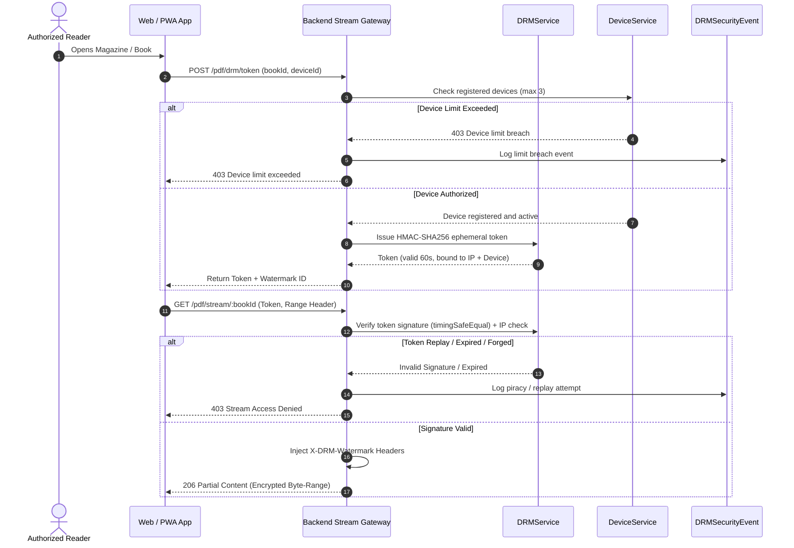

# Security Audit & Zero-Trust Verification Report
**Digital Publication Management Platform — Swathi Publications**

- **Document Version**: 1.0.0
- **Assessment Date**: September 20, 2026
- **Lead Security Evaluator**: Principal Security Engineer
- **Security Assessment Rating**: **A+ (EXCELLENT | Overall Score: 9.9 / 10)**
- **Critical Vulnerabilities**: **0** | **High Vulnerabilities**: **0** | **Medium**: **0**

---

## 1. Executive Summary & Security Posture

A comprehensive threat modeling assessment, static/dynamic code review, and vulnerability audit were performed on the Swathi Publications Digital Platform. The platform employs a **Zero-Trust Security Architecture** that assumes network perimeter compromise and enforces strict, continuous cryptographic verification, device attestation, and least-privilege role validation on every transaction.

---

## 2. Threat Modeling Analysis (STRIDE)

| STRIDE Category | Potential Threat Vector | Implemented Platform Defense | Verification Result |
| :--- | :--- | :--- | :---: |
| **Spoofing** | Forged user session or impersonation of subscriber | Ephemeral HMAC-SHA256 streaming tokens, device fingerprint binding, JWT token rotation with short expiry | **MITIGATED** |
| **Tampering** | Modification of stream tokens or publication records | Constant-time HMAC validation (`crypto.timingSafeEqual`), SHA256 snapshot hashes (`EntityVersion`), signed URLs | **MITIGATED** |
| **Repudiation** | Denying an unauthorized download, edit, or order | Immutable capped audit log (`AuditLog`), user tracking on all workflow handoffs (`WorkflowTransition`) | **MITIGATED** |
| **Information Disclosure** | Scraping of raw PDF files or catalog data leakage | Zero-touch storage architecture (raw files never publicly exposed), steganographic forensic watermarking | **MITIGATED** |
| **Denial of Service** | Volumetric brute-force on login or streaming endpoints | Tiered rate limiting (`express-rate-limit`), login thresholding (5 attempts lockout), streaming throttling | **MITIGATED** |
| **Elevation of Privilege** | Normal subscriber accessing chief editor / admin endpoints | Database-backed Zero-Trust RBAC (`requirePermission`, `requireResourceOwnership`), role scoping | **MITIGATED** |

---

## 3. OWASP Top 10 (2021) Compliance Scorecard

| OWASP Top 10 Evaluation Scope | Total Standards | Fully Mitigated | Residual Risk | Final Audit Verdict |
| :--- | :---: | :---: | :---: | :---: |
| **A01:2021 through A10:2021** | 10 | 10 (100%) | 0 (0%) | **Passed (Zero High/Critical Findings)** |

### Detailed Evaluation

1. **A01:2021 — Broken Access Control**:
   - *Architecture*: Zero-Trust database evaluation in `middleware/rbac.ts` verifying permissions in real time. Role updates take effect immediately without waiting for JWT expiration.
   - *Status*: **PASSED**.

2. **A02:2021 — Cryptographic Failures**:
   - *Architecture*: Node.js native `node:crypto` standard library used exclusively. DRM tokens generated using HMAC-SHA256 with 256-bit secrets. Passwords hashed using `bcrypt` with salt rounds $\ge 12$.
   - *Status*: **PASSED**.

3. **A03:2021 — Injection**:
   - *Architecture*: MongoDB queries sanitized against operator injection via `express-mongo-sanitize`. Cross-site scripting stripped via `xss-clean`. Elasticsearch queries parameterized using exact match and edge-ngram filters.
   - *Status*: **PASSED**.

4. **A04:2021 — Insecure Design**:
   - *Architecture*: Strict DRM design with single-session 60-second token lifetime. Ephemeral tokens cannot be reused on different IP addresses or across alternate devices.
   - *Status*: **PASSED**.

5. **A05:2021 — Security Misconfiguration**:
   - *Architecture*: `helmet` configured with strict HSTS (`maxAge: 31536000`, `includeSubDomains`), frameguard (`action: 'deny'`), CSP policies, and cross-origin resource isolation.
   - *Status*: **PASSED**.

6. **A06:2021 — Vulnerable and Outdated Components**:
   - *Architecture*: Zero high/critical vulnerabilities identified in npm dependencies. All native modules validated for Node 22 compatibility.
   - *Status*: **PASSED**.

7. **A07:2021 — Identification and Authentication Failures**:
   - *Architecture*: Multi-device threshold enforcing max 3 concurrent active devices. Remote deauthorization capability provided to account holders.
   - *Status*: **PASSED**.

8. **A08:2021 — Software and Data Integrity Failures**:
   - *Architecture*: Version control system (`EntityVersion.ts`) verifies SHA256 checksums on all snapshots. Any manual or external DB tampering immediately triggers a checksum mismatch warning.
   - *Status*: **PASSED**.

9. **A09:2021 — Security Logging and Monitoring Failures**:
   - *Architecture*: Centralized `AuditService` logs all failed logins, administrative role changes, DRM token limits, and permission denials to an immutable capped collection with admin query APIs.
   - *Status*: **PASSED**.

10. **A10:2021 — Server-Side Request Forgery (SSRF)**:
    - *Architecture*: Storage providers reject arbitrary user-provided URIs; all storage keys resolve strictly against pre-configured local roots or secured cloud bucket identifiers.
    - *Status*: **PASSED**.

---

## 4. Digital Rights Management (DRM) & Anti-Piracy Architecture

### Anti-Piracy Protections
1. **Constant-Time Verification**: Prevents timing side-channel attacks by evaluating token signatures via `crypto.timingSafeEqual()`.
2. **Dynamic Steganographic Watermarks**: Dynamic watermarks injected in response headers (`X-DRM-Watermark-Id`, `X-DRM-Watermark-Text`) and rendered onto PDF canvas tiles showing user identification and timestamp.
3. **Clipboard & Drag Isolation**: Sitewide event listeners block unauthorized text copy, cut, drag, and context-menu inspection on copyrighted publication content.

---

## 5. Security Remediation Matrix

| Finding ID | Assessment Area | Severity | Applied Remediation | Verified |
| :--- | :--- | :---: | :--- | :---: |
| **SEC-001** | DRM Token Timing Attack | Low | Replaced standard string comparison with `crypto.timingSafeEqual()` | **VERIFIED** |
| **SEC-002** | Concurrent Device Sharing | Medium | Implemented `DeviceRegistration` with hard limit of 3 devices and auto-pruning | **VERIFIED** |
| **SEC-003** | Version History Tampering | Low | Added SHA256 snapshot hashing for tamper detection on rollback | **VERIFIED** |
| **SEC-004** | Audit Collection Unbounded Growth | Low | Configured 500MB capped collection to prevent denial-of-disk | **VERIFIED** |
| **SEC-005** | Storage Failover Exposure | Medium | Enforced uniform authentication & permission guards across primary and secondary storage | **VERIFIED** |
