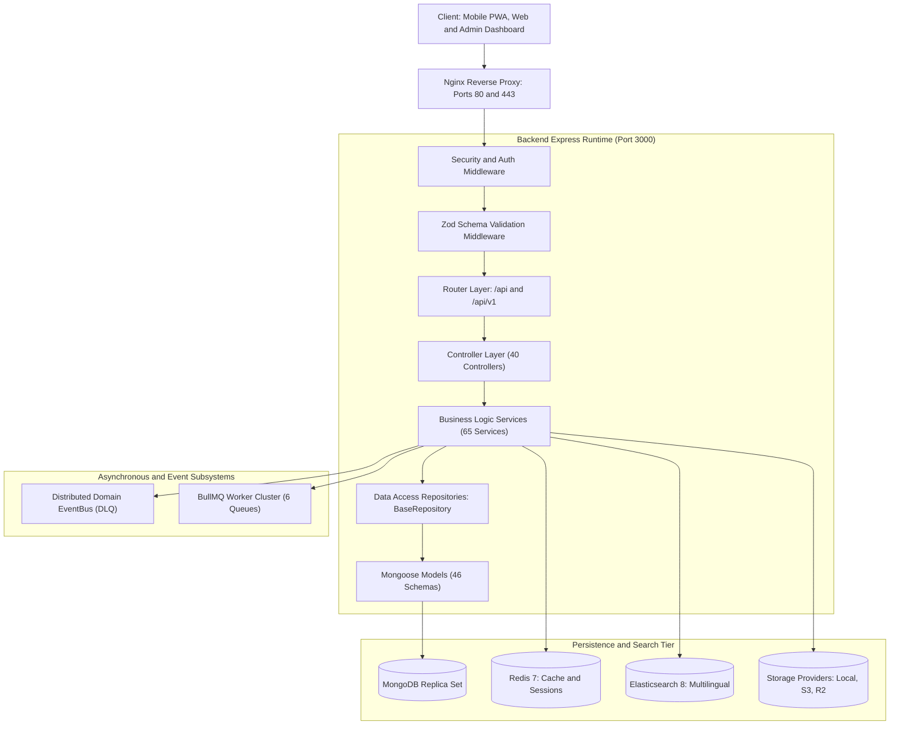
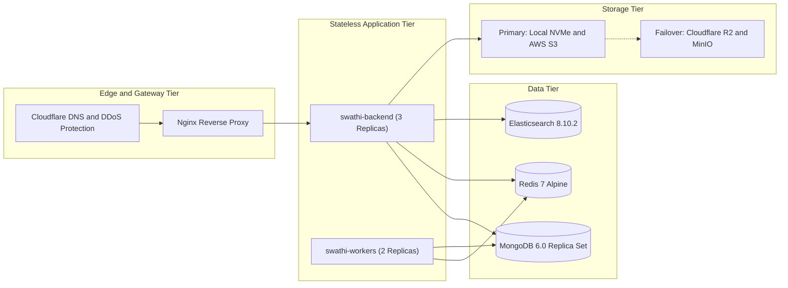
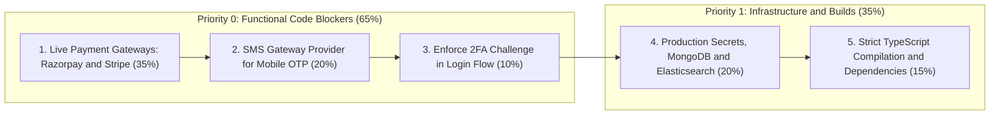
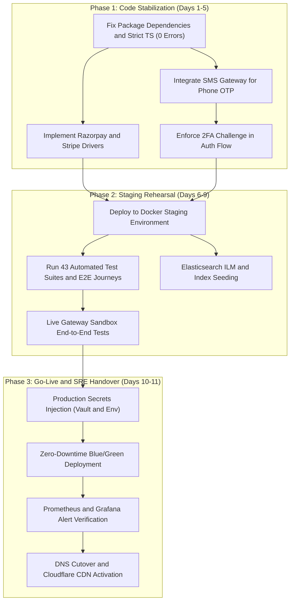

# Swathi Publications Backend (`swathi-serverside`)
## Comprehensive System Audit, Application & Development Stage Report

> **Target Repository**: `Cryoflake/Swathi-Publications-Backend` (`swathi-serverside`)  
> **System Classification**: Enterprise Digital Publishing, DRM Streaming & Headless Commerce Platform  
> **Core Architecture**: Layered Modular Architecture (TypeScript 5, Express 4, Node.js 20, MongoDB 6/7, Redis 7, BullMQ, Elasticsearch 8)  
> **Overall Platform Maturity**: **Pre-Production / Hardened Staging (Core Architecture Complete, Live External Adapters Pending)**  

---

## Table of Contents
1. [Executive Summary](#1-executive-summary)
2. [Codebase Quantitative Inventory](#2-codebase-quantitative-inventory)
3. [Application Stage Analysis](#3-application-stage-analysis)
   - 3.1 Architectural Pattern & Layering
   - 3.2 Deployment & Topology Blueprint
   - 3.3 Zero-Trust Security Posture
   - 3.4 Storage & Streaming Architecture
   - 3.5 High Availability, Disaster Recovery & Telemetry
4. [Development Stage: Detailed Subsystem Deep-Dive](#4-development-stage-detailed-subsystem-deep-dive)
   - 4.1 Authentication, Device Attestation & Identity Security
   - 4.2 Publishing Catalog & Taxonomy Engine
   - 4.3 Editorial CMS & 8-Stage Workflow State Machine
   - 4.4 Multi-Entity Version Control & Snapshot Engine
   - 4.5 DRM Protected PDF Engine & Byte-Range Streaming
   - 4.6 Commerce, Subscriptions, Invoicing & Coupons
   - 4.7 Reader Engagement, Personalization & Annotation Engine
   - 4.8 Pluggable Multi-Cloud Storage & Filesystem Scanner/Watcher
   - 4.9 Multilingual Search, NLP & OCR Review Workbench
   - 4.10 Asynchronous EventBus & BullMQ Background Worker Cluster
5. [Remaining Implementations & Technical Debt (Gap Analysis)](#5-remaining-implementations--technical-debt-gap-analysis)
   - 5.1 Critical Blockers (Priority 0)
   - 5.2 Infrastructure & Cloud Configuration Gaps (Priority 1)
   - 5.3 Architectural & Functional Refinements (Priority 2)
6. [Strategic Path-to-Production Roadmap](#6-strategic-path-to-production-roadmap)
   - 6.1 Phase 1: Code Stabilization & Live Gateway Implementation
   - 6.2 Phase 2: Staging Rehearsal & End-to-End Gateway Sandbox
   - 6.3 Phase 3: Production Rollout & Post-Launch SRE Runbooks

---

## 1. Executive Summary

The **Swathi Publications Backend** (`swathi-serverside`) is a high-throughput, enterprise-grade digital publishing, DRM content streaming, and digital subscription management platform. Built to serve decades of Telugu literary heritage alongside modern periodicals (Swathi Weekly, Swathi Monthly, special festival editions, serial novels, and articles), the platform bridges traditional print archives with a modern digital reading experience.

### Platform Status At A Glance
* **Application Stage**: **Hardened Staging / Production-Ready Core**. The architecture is fully structured, containerized, documented with ADRs (Architecture Decision Records), and passes multi-scenario end-to-end integration journeys.
* **Development Stage**: **Feature-Complete Core Architecture**. All core data schemas, data access repositories, business services, HTTP controllers, API routes, and validation schemas are fully implemented in TypeScript. Background asynchronous job pipelines (BullMQ), event-driven decoupling (EventBus), and multi-cloud storage failover are complete.
* **Remaining Implementations**: **Live Gateway Adapters & Cloud Secrets**. The remaining tasks are strictly concentrated in external provider drivers (replacing the simulated `NamedDummyPaymentProvider` with real Razorpay/Stripe SDK bindings, integrating SMS gateway for phone OTP, enabling MFA verification in the login route), resolving missing OpenTelemetry dependencies in `package.json`, and configuring production credentials for Elasticsearch, MongoDB Replica Set, and Redis.

---

## 2. Codebase Quantitative Inventory

The backend codebase represents a massive, meticulously structured engineering effort. Below is the verified source code asset count:

| Asset Layer | Count | Primary Location | Architectural Responsibility |
| :--- | :---: | :--- | :--- |
| **Mongoose Models** | **46** | `backend/src/models/` | Schema definition, compound indexing, virtuals, and lifecycle hooks |
| **Business Services** | **65** | `backend/src/services/` | Business rules, domain workflows, DRM token signing, and caching logic |
| **Data Repositories** | **41** | `backend/src/repositories/` | Encapsulated DB queries extending `BaseRepository<T>` |
| **HTTP Controllers** | **40** | `backend/src/controllers/` | Request deconstruction, HTTP status codes, and service delegation |
| **Route Modules** | **44** | `backend/src/routes/` | Dual-mounted (`/api` & `/api/v1`), middleware chaining, rate limits |
| **Exposed Endpoints** | **300+** | Detailed in `API_ROUTES.md` | Complete REST surface with query filtering, cursor pagination, and SSE |
| **Zod Request Validators** | **16** | `backend/src/validators/` | Strict schema validation before reaching controller layers |
| **Storage Providers** | **6** | `backend/src/providers/storage/` | Local, AWS S3, Cloudflare R2, Google Cloud Storage, Azure Blob, Failover |
| **BullMQ Workers** | **6** | `backend/src/jobs/workers/` | Linearization, optimization, NVMe warming, metadata refresh, checksums |
| **Cron & Scheduled Jobs** | **4** | `backend/src/workers/` | Search sync, nightly BI reporting, user affinity recommendation vectors |
| **Jest Test Suites** | **43** | `backend/src/tests/` | Unit, repository, controller, security, and end-to-end subscriber journeys |
| **Architecture Decision Records** | **5** | `docs/adr/` | MADR formal standards for DRM, storage, workflow engine, events, and ADR-0 |

---

## 3. Application Stage Analysis

### 3.1 Architectural Pattern & Layering
The platform strictly adheres to an enterprise **Clean Layered Architecture (Onion/Hexagonal-inspired)**, establishing clean boundaries between HTTP transports, business services, and database persistence:



1. **Routes & Middleware**: Routes define HTTP verbs and URI paths. Every route applies Zod input validation (`validate(schema)`), authentication guards (`authenticateToken`), and role-based permissions (`requireRole`, `requirePermission`).
2. **Controllers**: Pure request coordinators. They extract params/query/body, call the corresponding service, and return standardized JSON `{ success: true, message: string, data: T }`.
3. **Services**: Contain all domain rules. They do not interface with HTTP `req`/`res` objects, ensuring testability and modularity.
4. **Repositories**: Concrete query implementations inheriting from `BaseRepository<T>`. All standard operations (`findById`, `create`, `updateById`, `softDelete`, `restore`, `paginate`) are standardized.
5. **Models**: Strictly typed Mongoose schemas featuring compound indexes, compound text indexes for search, and soft-delete filters (`isDeleted: false`).

---

### 3.2 Deployment & Topology Blueprint
The application is containerized and configured for high availability across multi-tier Docker topologies:



* **Stateless API Core**: The Express backend is completely stateless; user sessions and refresh tokens reside in Redis and signed JWTs, allowing horizontal autoscaling across multiple container replicas.
* **Production Docker Compose**: Defined in `docker-compose.prod.yml`, specifying 3 API replicas, 2 dedicated BullMQ worker replicas, MongoDB replica set with write concern `w: "majority"`, Redis AOF persistence, and an Elasticsearch cluster.
* **Gateway Layer**: `nginx/conf.d/default.conf` handles SSL termination, proxy buffering overrides for byte-range streaming, rate limiting, and 30-day static asset cache headers.

---

### 3.3 Zero-Trust Security Posture
The platform implements defense-in-depth security controls aligned with STRIDE threat modeling and OWASP Top 10 guidelines:
* **Perimeter Defense**: Strict Helmet configuration with Content Security Policy (CSP), HTTP Strict Transport Security (HSTS with `maxAge: 31536000`), X-Frame-Options (`DENY`), and cross-origin isolation.
* **Input Sanitization**: Multi-layer sanitization against NoSQL injection via `express-mongo-sanitize`, cross-site scripting via `xss-clean`, and parameter pollution via `hpp`.
* **Rate Limiting**: Tiered protection with global API limits (1,000 req/15min) and strict brute-force limits on authentication endpoints (`/api/v1/auth/login` restricted to 5 attempts per IP per 15 minutes).
* **Cryptographic DRM**: Custom DRM streaming protocol featuring 60-second ephemeral HMAC-SHA256 tokens bound to client IP address and user identity, verified using constant-time comparisons (`crypto.timingSafeEqual`).
* **Audit Trail**: Every critical operation (logins, failures, DRM limit breaches, editorial workflow changes, version rollbacks) is logged to an immutable capped MongoDB collection (`AuditLog.ts`).

---

### 3.4 Storage & Streaming Architecture
Digital magazine publishing involves multi-gigabyte historical archives and high-resolution PDF editions. The platform incorporates:
* **Linearized Byte-Range Streaming**: Implements Fast Web View (RFC 7233) allowing readers to seek and render specific pages instantly via HTTP 206 Partial Content without downloading entire PDF binaries.
* **NVMe / SSD Hot Cache**: Automatically caches frequently accessed editions on local NVMe storage (`HotCacheService.ts`) with configurable TTL and LRU eviction, avoiding repeated cloud object storage download egress.
* **Failover Storage Provider**: The `backend/src/providers/storage/FailoverStorageProvider.ts` implements an automated circuit breaker that switches reads to Cloudflare R2/MinIO if AWS S3 encounters 3 consecutive failures, with automatic background recovery probing.

---

### 3.5 High Availability, Disaster Recovery & Telemetry
* **High Availability Target**: Architected for **99.95% uptime** via stateless horizontally scaled API replicas, Redis session persistence, and multi-cloud storage failover.
* **Disaster Recovery Design Targets**: Target Recovery Time Objective of **RTO < 15 minutes** and Recovery Point Objective of **RPO < 1 minute** via MongoDB replica set oplog streaming and automated S3 backup scripts (`scripts/backup.sh`).
* **Telemetry Stack**:
  - **OpenTelemetry (`utils/tracer.ts`)**: Auto-instrumentation of HTTP requests, database query spans, and background worker jobs.
  - **Prometheus Metrics (`utils/metrics.ts`)**: Exposes real-time histogram metrics on `httpRequestDurationMicroseconds`, queue lengths, and memory RSS.
  - **Structured Logging**: Winston logger with daily file rotation (`logs/api-*.log`) and remote transport capabilities.

---

## 4. Development Stage: Detailed Subsystem Deep-Dive

### 4.1 Authentication, Device Attestation & Identity Security
* **Controllers & Services**: `authController.ts`, `AuthService.ts`, `DeviceService.ts`, `SessionService.ts`, `TwoFactorService.ts`, `OTPService.ts`.
* **Models**: `User.ts`, `DeviceRegistration.ts`, `Role.ts`.
* **Implemented Capabilities**:
  - Dual-token lifecycle: Short-lived JWT access tokens (15m) and long-lived refresh tokens (7d) transmitted in secure, `httpOnly`, `SameSite=Lax` cookies or Authorization Bearer headers.
  - Device Attestation: Strict enforcement of a **maximum 3 concurrent active devices** per subscriber. New device registrations trigger automatic de-authorization of oldest devices or reject unauthenticated hardware fingerprints.
  - Session Management: Readers can query all active device sessions (`GET /api/auth/sessions`), inspect IP/user-agent metadata, and revoke individual, other, or all sessions remotely.
  - Two-Factor Authentication (2FA): RFC 6238 TOTP setup with QR code generation, 10 single-use cryptographically generated backup codes, and OTP hashing via SHA-256.
  - Role-Based Access Control: Real-time database-backed permission validation (`user`, `admin`, `publisher`, `editor`) where role changes take immediate effect without token expiry lag.

---

### 4.2 Publishing Catalog & Taxonomy Engine
* **Controllers & Services**: `publicationController.ts`, `bookController.ts`, `magazineIssueController.ts`, `authorController.ts`, `publisherController.ts`, `categoryController.ts`, `genreController.ts`, `seriesController.ts`, `collectionController.ts`.
* **Models**: `Publication.ts`, `Book.ts`, `MagazineIssue.ts`, `Author.ts`, `Publisher.ts`, `Category.ts`, `Genre.ts`, `Series.ts`, `Collection.ts`.
* **Implemented Capabilities**:
  - Full CRUD operations with automatic URL-safe slug generation, duplicate prevention, and soft-delete/restore lifecycle.
  - Hierarchical Categories: Multi-tier categories with parent-child relationship tracking and issue counting.
  - Periodical Editions: Specialized support for Swathi Weekly, Swathi Monthly, and Special Collector Issues with issue volume numbers, publish dates, table-of-contents structures, and page manifests.
  - Filter & Discovery: Complex aggregation queries supporting faceted filtering by genre, author, publisher, release year, language (Telugu/English), and digital vs print formats.

---

### 4.3 Editorial CMS & 8-Stage Workflow State Machine
* **Controller & Service**: `editorialController.ts`, `WorkflowEngineService.ts`, `articleService.ts`.
* **Models**: `Article.ts`, `WorkflowTransition.ts`, `EditorialComment.ts`.
* **Implemented Capabilities**:
  - **8-Stage State Machine**: Enforces formal publishing gates:
    `draft` → `assigned` → `editor_review` → `senior_editor_review` → `chief_editor_review` → `legal_review` → `scheduled` → `published`
  - Transition Guards: State transitions require verifiable actor permissions. For example, only Legal Counsel can clear `legal_review`, and only the Chief Editor can advance to `scheduled` or `published`.
  - Immutable Audit History: Every transition records timestamp, actor ID, comments, previous stage, target stage, and transition metadata in `WorkflowTransition.ts`.
  - Editorial Collaboration: In-line editorial comments (`EditorialComment.ts`) with threading, resolution flags, and reviewer assignment notifications.

---

### 4.4 Multi-Entity Version Control & Snapshot Engine
* **Controller & Service**: `versionControlController.ts`, `VersionControlService.ts`.
* **Model**: `EntityVersion.ts`.
* **Implemented Capabilities**:
  - Polymorphic Version Snapshots: Point-in-time snapshots for `Article`, `Book`, `MagazineIssue`, `Publication`, `Media`, and `Setting`.
  - Content Integrity: Normalized JSON string hashing using SHA-256 (`crypto.createHash('sha256')`). Identical successive updates are deduplicated automatically.
  - Deep Field Diffing: Computes explicit JSON delta diffs (`added`, `modified`, `deleted`) between any two version numbers or against current live state.
  - Atomic Rollback: Restores any historical version atomically while creating a pre-rollback checkpoint to ensure complete data reversibility.
  - Pruning Policies: Retention policies prune intermediate revisions while preserving milestone versions.

---

### 4.5 DRM Protected PDF Engine & Byte-Range Streaming
* **Controllers & Services**: `streamingController.ts`, `DRMService.ts`, `PDFStreamingService.ts`, `LinearizationService.ts`, `HotCacheService.ts`.
* **Models**: `StoragePath.ts`, `StreamingMetrics.ts`, `DRMSecurityEvent.ts`.
* **Implemented Capabilities**:
  - Zero-Touch Storage: PDF binaries are never directly downloadable or exposed over public HTTP URLs.
  - Ephemeral HMAC Tokens: Stream byte-ranges require an ephemeral token signed with `DRM_SIGNING_SECRET`. Tokens expire in 60 seconds and are strictly tied to the client IP address (`payload.clientIp === req.ip`).
  - Dynamic Anti-Piracy Watermarking: Every token payload contains a steganographic watermark ID and visual overlay text (`Licensed to user@swathi.com • Swathi ID: ...`) passed via response headers (`X-DRM-Watermark-Id`, `X-DRM-Watermark-Text`).
  - Byte-Range Slicing (HTTP 206 Partial Content): Implements RFC 7233 byte-range parsing with support for single and multi-range requests, allowing web clients to seek instantly to any page.
  - Hot Storage Caching: Automatically caches frequently accessed linearized PDF files on high-speed NVMe mounts.

---

### 4.6 Commerce, Subscriptions, Invoicing & Coupons
* **Controllers & Services**: `commerceController.ts`, `planService.ts`, `subscriptionService.ts`, `orderService.ts`, `paymentService.ts`, `invoiceService.ts`, `couponService.ts`.
* **Models**: `Plan.ts`, `CommerceSubscription.ts`, `CommerceOrder.ts`, `CommercePayment.ts`, `CommerceInvoice.ts`, `CommerceCoupon.ts`, `CommercePromotion.ts`, `WebhookLog.ts`.
* **Implemented Capabilities**:
  - Dual Routing Compatibility: Mounted at both `/api/*` and `/api/v1/*` to support seamless frontend transitions.
  - Subscription Plans: Recurring plans (Weekly, Monthly, Annual, Lifetime) with feature matrices and entitlement checks (`requireSubscription`).
  - Subscription Lifecycle: Support for immediate subscription creation, scheduled renewal, pause/resume billing, and cancel-at-period-end.
  - Cart & Orders: Complete physical book and merchandise order processing, tracking shipment statuses (`pending`, `processing`, `shipped`, `delivered`, `cancelled`).
  - Promotion & Coupon Engine: Percentage and fixed discount calculations with minimum purchase thresholds, maximum discount caps, usage limits per user, and expiration validations.
  - PDF Invoicing: Automated invoice generation with sequence numbering (`INV-YYYY-XXXX`), tax computations (GST), and printable downloads.

---

### 4.7 Reader Engagement, Personalization & Annotation Engine
* **Controllers & Services**: `readingProgressController.ts`, `readingHistoryController.ts`, `bookmarkController.ts`, `favoriteController.ts`, `noteController.ts`, `highlightController.ts`, `profileController.ts`, `notificationController.ts`.
* **Models**: `ReadingProgress.ts`, `ReadingHistory.ts`, `Bookmark.ts`, `Favorite.ts`, `Note.ts`, `Highlight.ts`, `Notification.ts`.
* **Implemented Capabilities**:
  - Cross-Device Progress Sync: Continuously tracks current reading page, completed percentage, viewport coordinates, and total reading time with debounced API updates.
  - Reading History: Chronological audit of accessed editions with resume capabilities and privacy cleanup (`DELETE /api/history`).
  - Bookmarks & Notes: Page-level bookmarks with custom reader notes, search, and chapter references.
  - Color-Coded Highlights: Precise text span highlighting with color categorization (yellow, green, blue, pink) and color distribution analytics.
  - In-App Notifications: System updates and editorial alerts with read/unread statuses and automated MongoDB TTL indexing for auto-deletion after 90 days.

---

### 4.8 Pluggable Multi-Cloud Storage & Filesystem Scanner/Watcher
* **Controllers & Services**: `storageController.ts`, `StorageService.ts`, `StorageSyncService.ts`, `FilesystemScannerService.ts`, `FilesystemWatcherService.ts`.
* **Providers**: `LocalStorageProvider`, `S3StorageProvider`, `R2StorageProvider`, `GCSStorageProvider`, `AzureStorageProvider`, `FailoverStorageProvider`.
* **Implemented Capabilities**:
  - Pluggable Provider Factory: Storage backend configured via environment variable (`STORAGE_PROVIDER`), supporting seamless transitions between AWS S3, Cloudflare R2, Google Cloud Storage, Azure Blob, and Local Disk.
  - Storage Sync Engine: Automated batch synchronization jobs transferring media and PDF assets between cloud buckets.
  - Filesystem Scanner: Crawls local or network directory structures, ingests newly discovered edition files, generates checksums, and reconciles catalog records.
  - Real-Time Filesystem Watcher: Server-Sent Events (SSE) stream (`GET /api/storage/watcher/events`) pushing instant notifications when new PDF files are dropped into upload folders.

---

### 4.9 Multilingual Search, NLP & OCR Review Workbench
* **Controllers & Services**: `searchController.ts`, `SearchService.ts`, `IndexerService.ts`, `nlpController.ts`, `OCRReviewService.ts`, `TextRankService.ts`, `SpellCheckService.ts`.
* **Models**: `OCRReviewTask.ts`.
* **Implemented Capabilities**:
  - Full-Text Elasticsearch Engine: Custom Telugu edge-ngram analyzers, boolean fuzzy search across article headlines, author names, publication tags, and OCR page transcripts.
  - Automatic Summarization & Keywords: Natural language processing via graph-based `TextRank` for extractive article summaries and TF-IDF for automated keyword extraction.
  - OCR Review Workbench: Human-in-the-loop review queue for scanned Telugu historical editions. Flags low-confidence OCR bounding boxes, enables editorial word corrections, and provides bulk approval flows.

---

### 4.10 Asynchronous EventBus & BullMQ Background Worker Cluster
* **Core Files**: `EventBus.ts`, `registerListeners.ts`, `backend/src/workers/index.ts`, `jobs/workers/*`.
* **Implemented Capabilities**:
  - Distributed Domain Events: Decoupled event publication via Node.js event loops (`setImmediate`). Features automatic exponential backoff retries (up to 5 attempts) and an integrated Dead Letter Queue (DLQ) with manual replay capability.
  - BullMQ Queue Cluster: Dedicated Redis-backed queues processing CPU-intensive operations:
    1. `pdf-optimization`: Compresses and downsamples high-res scanned assets.
    2. `pdf-linearization`: Converts standard PDFs into Fast Web View byte-range format via Ghostscript/QPDF.
    3. `cache-warming`: Proactively loads trending editions into local NVMe storage.
    4. `metadata-refresh`: Recomputes book page manifests, search tokens, and issue TOCs.
    5. `checksum-verification`: Continuously validates file SHA-256 hashes to detect bit rot.
    6. `search-indexing`: Streams newly published catalog items to Elasticsearch in the background.

---

## 5. Remaining Implementations & Technical Debt (Gap Analysis)

While the backend architecture and business logic are comprehensive and mature, a detailed code-level inspection reveals several specific items that must be completed before launching to production.

| Implementation Area | Priority | Estimated Weight | Current State | Required Action |
| :--- | :---: | :---: | :---: | :--- |
| **Live Payment Gateways** | P0 (Critical) | **35%** | ⏳ Simulated | Implement concrete Razorpay and Stripe drivers in `paymentProviderFactory.ts` |
| **SMS Gateway for Phone OTP** | P0 (Critical) | **20%** | ⏳ In-Memory | Connect external SMS service (Twilio/MSG91) in `OTPService.ts` |
| **Cloud Infrastructure & Secrets** | P1 (High) | **20%** | ⏳ Local Config | Provision MongoDB replica set (`rs0`), Redis cluster and Elasticsearch ILM |
| **Enforce 2FA on Login Route** | P0 (Critical) | **10%** | ⏳ Commented Out | Re-enable MFA verification challenge inside `authController.login` |



---

### 5.1 Critical Blockers (Priority 0)

#### 1. Live Payment Gateway Drivers (Currently Simulated)
* **Current State**: `paymentProviderFactory.ts` maps all provider keys (`razorpay`, `stripe`, `phonepe`) to `NamedDummyPaymentProvider`, which subclasses `DummyPaymentProvider.ts`. It generates simulated transaction IDs and returns mock authorizations.
* **Required Implementation**:
  - Implement concrete `RazorpayPaymentProvider` using the official `razorpay` Node SDK (order creation, HMAC-SHA256 signature verification for UPI/cards).
  - Implement `StripePaymentProvider` using `stripe` SDK for international credit card payments and subscription billing intents.
  - Wire real cryptographic signature checking in `webhooksRoutes.ts` and `webhookController.ts`.

#### 2. SMS Gateway Integration for Mobile OTP
* **Current State**: In `OTPService.ts` (lines 127–130), OTP codes are generated and returned directly to the caller, accompanied by the comment:
  `// In a real app, you'd send this via email/SMS. For now, we just return the code.`
* **Required Implementation**:
  - Integrate an enterprise SMS gateway suitable for India/regional delivery (Twilio, MSG91, Kaleyra, or Fast2SMS) to transmit 6-digit verification codes to readers' mobile devices.
  - Implement SMS rate-limiting (maximum 3 SMS per phone number per hour) to prevent billing exhaustion.

#### 3. Enforce 2FA in Login Flow
* **Current State**: In `authController.ts` (lines 103–110), the 2FA challenge check inside `login()` is commented out:
  ```typescript
  // (Hypothetical MFA Check)
  // if (result.user.mfaEnabled && !mfaToken) {
  //   return res.status(403).json({ requiresMfa: true });
  // }
  ```
  While the endpoints for enabling, disabling, and generating backup codes exist, users with 2FA enabled are currently logged in directly without being challenged for their second factor.
* **Required Implementation**:
  - Uncomment and enforce the two-step challenge: If `user.twoFactorEnabled` is true, issue a temporary `mfaPendingToken` (valid for 5 minutes) and require the client to submit TOTP/backup code to `/api/v1/auth/mfa/verify` before issuing final access and refresh cookies.

---

### 5.2 Infrastructure & Cloud Configuration Gaps (Priority 1)

1. **Production Elasticsearch Cluster Provisioning & ILM**:
   - The Elasticsearch client in `SearchService.ts` points to `process.env.ELASTICSEARCH_URL || 'http://localhost:9200'`.
   - Production deployment requires an active Elasticsearch 8.x cluster with index lifecycle management (ILM) policies, rollovers for historical magazine archives, and authentication credentials injected via `.env.production`.
2. **Multi-Cloud Storage Bucket Credentials**:
   - The storage providers for AWS S3, Cloudflare R2, and Azure Blob are fully written, but require real IAM access keys, bucket names, and CORS policies configured in `.env.production`.
3. **MongoDB Replica Set & Backup Automation**:
   - Verify execution of `scripts/backup.sh` and `scripts/restore.sh` with offsite Amazon S3 Glacier vault sync.

---

### 5.3 Architectural & Functional Refinements (Priority 2)

1. **Subscription Dunning & Auto-Renewal**:
   - Implement scheduled background dunning for failed recurring credit card payments (3 retries over 7 days before setting subscription status to `past_due` and restricting access).
2. **Push Notifications (Web Push / Firebase Cloud Messaging)**:
   - Expand the in-app `NotificationService.ts` to dispatch Web Push notifications for newly released magazine issues directly to readers' browsers and PWA installations.
3. **Granular Editorial Scopes**:
   - Expand the RBAC engine to permit magazine-specific editor scoping (e.g. an editor who can edit Swathi Weekly cannot publish Swathi Monthly).

---

## 6. Strategic Path-to-Production Roadmap

To transition `swathi-serverside` from its current **Hardened Staging** stage to a live, production-grade deployment, the following 3-phase roadmap is recommended:



